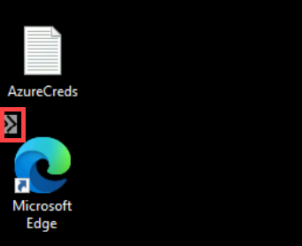
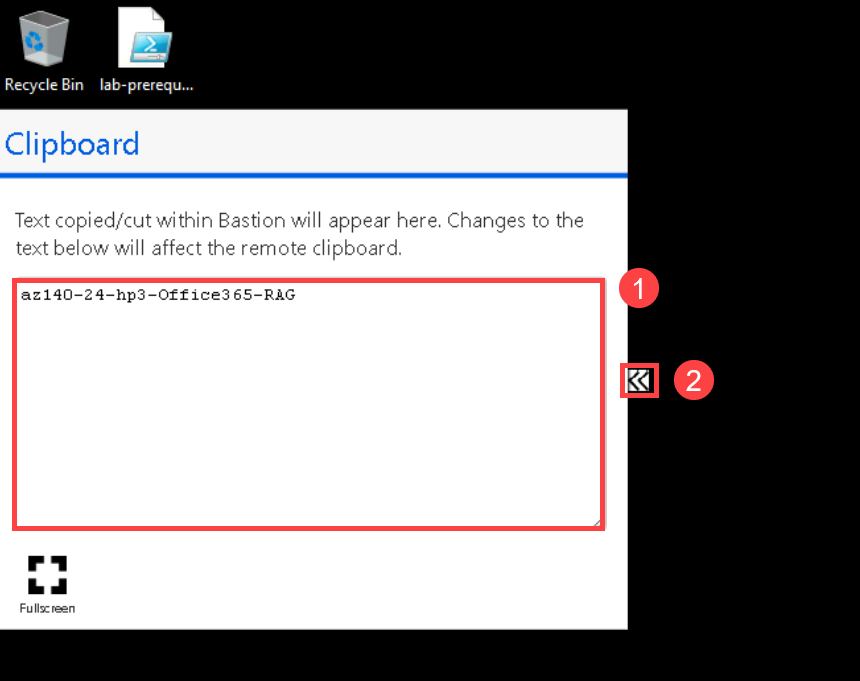
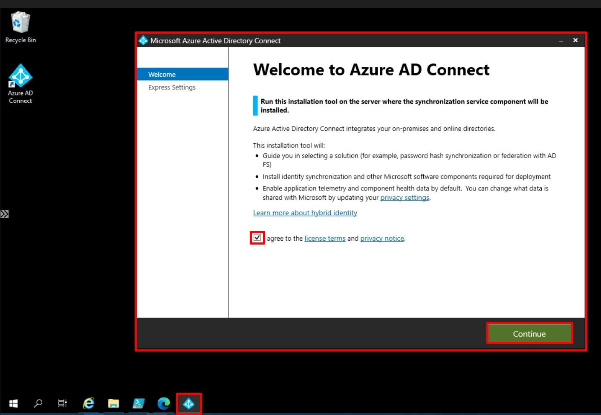

# Lab - Prepare for deployment of Azure Virtual Desktop (AD DS)
# Student lab manual

## Lab dependencies

- An Azure subscription you will be using in this lab.
- A Microsoft account or an Azure AD account with the Owner or Contributor role in the Azure subscription you will be using in this lab and with the Global Administrator role in the Azure AD tenant associated with that Azure subscription.

## Estimated Time

60 minutes

## Lab scenario

You need to prepare for deployment of an Active Directory Domain Services (AD DS) environment

## Objectives
  
After completing this lab, you will be able to:

- Deploy an Active Directory Domain Services (AD DS) single-domain forest by using Azure VMs
- Integrate an AD DS forest with an Azure Active Directory (Azure AD) tenant

## Lab files

-  \\\\AZ-140\\AllFiles\\Labs\\01\\az140-11_azuredeploydc11.parameters.json
-  \\\\AZ-140\\AllFiles\\Labs\\01\\az140-11_azuredeploycl11.json
-  \\\\AZ-140\\AllFiles\\Labs\\01\\az140-11_azuredeploycl11.parameters.json

## Instructions

### Exercise 1: Deploy an Active Directory Domain Services (AD DS) domain

The main tasks for this exercise are as follows:

1. Prepare for an Azure VM deployment
1. Deploy an Azure VM running an AD DS domain controller by using an Azure Resource Manager QuickStart template
1. Deploy an Azure VM running Windows 10 by using an Azure Resource Manager QuickStart template
1. Deploy Azure Bastion

#### Task 1: Prepare for an Azure VM deployment

1. From your lab computer, start a web browser, navigate to the [Azure portal](https://portal.azure.com), and sign in by providing credentials of a user account with the Owner role in the subscription you will be using in this lab.
1. In the web browser displaying the Azure portal, navigate to the **Overview** blade of the Azure AD tenant and, in the vertical menu on the left side, in the **Manage** section, click **Properties**.
1. On the **Properties** blade of your Azure AD tenant, at the very bottom of the blade, select the **Manage Security defaults** link.
1. On the **Enable Security defaults** blade, if it is enabled, disable it by toggling it to **No**. In the feedback section below, select **My organization is using Conditional Access** checkbox, and select **Save**.
1. In the Azure portal, open **Cloud Shell** pane by selecting on the toolbar icon directly to the right of the search textbox.
1. If prompted to select either **Bash** or **PowerShell**, select **PowerShell**. 

   >**Note**: If this is the first time you are starting **Cloud Shell** and you are presented with the **You have no storage mounted** message, select the subscription you are using in this lab, and select **Create storage**. 


#### Task 2: Deploy an Azure VM running an AD DS domain controller by using an Azure Resource Manager QuickStart template

1. On the lab computer, in the web browser displaying the Azure portal, from the PowerShell session in the Cloud Shell pane, run the following to create a resource group (replace the `<Azure_region>` placeholder with the name of the Azure region that you intend to use for this lab, such as, for example, `eastus`):

   ```powershell
   $location = '<Azure_region>'
   $resourceGroupName = 'az140-11-RG'
   New-AzResourceGroup -Location $location -Name $resourceGroupName
   ```

1. In the Azure portal, close the **Cloud Shell** pane.
1. From your lab computer, in the same web browser window, open another web browser tab and navigate a customized version of QuickStart template named [Create a new Windows VM and create a new AD Forest, Domain and DC](https://github.com/CloudLabs-MOC/AZ-140-Configuring-and-Operating-Microsoft-Azure-Virtual-Desktop/blob/stage/Allfiles/Labs/01/README.md). 

  >**Note**: If you get **Microsoft Azure: Help us protect your account** page, then select **Skip for now(14 days until this is required)**.

1. On the **Create a new Windows VM and create a new AD Forest, Domain and DC** page, select **Deploy to Azure**. This will automatically redirect the browser to the **Create an Azure VM with a new AD Forest** blade in the Azure portal.
1. On the **Create an Azure VM with a new AD Forest** blade, select **Edit parameters**.
1. On the **Edit parameters** blade, select **Load file**, in the **Open** dialog box, navigate to the path **C:\AllFiles\AZ-140-Configuring-and-Operating-Microsoft-Azure-Virtual-Desktop\Allfiles\Labs\01** and select the file **az140-11_azuredeploydc11.parameters.json**, select **Open**, and then select **Save**. 
1. On the **Create an Azure VM with a new AD Forest** blade, specify the following settings (leave others with their existing values):

   |Setting|Value|
   |---|---|
   |Subscription|the name of the Azure subscription you are using in this lab|
   |Resource group|**az140-11-RG**|
   |Domain name|**adatum.com**|

1. On the **Create an Azure VM with a new AD Forest** blade, select **Review + create** and select **Create**.

   > **Note**: Wait for the deployment to complete before you proceed to the next task. This might take close to 20 minutes. 

#### Task 3: Deploy an Azure VM running Windows 10 by using an Azure Resource Manager QuickStart template

1. On the lab computer, in the web browser displaying the Azure portal, open a PowerShell session in the Cloud Shell pane, and run the following to add a subnet named **cl-Subnet** to the virtual network named **az140-adds-vnet11** you created in the previous task:

   ```powershell
   $resourceGroupName = 'az140-11-RG'
   $vnet = Get-AzVirtualNetwork -ResourceGroupName $resourceGroupName -Name 'az140-adds-vnet11'
   $subnetConfig = Add-AzVirtualNetworkSubnetConfig `
     -Name 'cl-Subnet' `
     -AddressPrefix 10.0.255.0/24 `
     -VirtualNetwork $vnet
   $vnet | Set-AzVirtualNetwork
   ```
 

1. In the Azure portal, in the toolbar of the Cloud Shell pane, select the **Upload/Download files** icon, in the drop-down menu select **Upload**, in the **Open** dialog box, navigate to the path **C:\AllFiles\AZ-140-Configuring-and-Operating-Microsoft-Azure-Virtual-Desktop\Allfiles\Labs\01** and select the template file **az140-11_azuredeploycl11.json** and select **Open**. This will upload the file into the Cloud Shell home directory.

1. Once again, select the **Upload/Download files** icon in the Cloud Shell pane, in the drop-down menu select **Upload**, in the **Open** dialog box, navigate to the path **C:\AllFiles\AZ-140-Configuring-and-Operating-Microsoft-Azure-Virtual-Desktop\Allfiles\Labs\01** and select the template file **az140-11_azuredeploycl11.parameters.json** and select **Open**.

1. From the PowerShell session in the Cloud Shell pane, run the following to deploy an Azure VM running Windows 10 that will serve as a client into the newly created subnet:

   ```powershell
   $location = (Get-AzResourceGroup -ResourceGroupName $resourceGroupName).Location
   New-AzResourceGroupDeployment `
     -ResourceGroupName $resourceGroupName `
     -Location $location `
     -Name az140lab0101vmDeployment `
     -TemplateFile $HOME/az140-11_azuredeploycl11.json `
     -TemplateParameterFile $HOME/az140-11_azuredeploycl11.parameters.json
   ```

   > **Note**: Do not wait for the deployment to complete but instead proceed to the next task. The deployment might take about 10 minutes.

#### Task 4: Deploy Azure Bastion 

> **Note**: Azure Bastion allows for connection to the Azure VMs without public endpoints which you deployed in the previous task of this exercise, while providing protection against brute force exploits that target operating system level credentials.

> **Note**: Ensure that your browser has the pop-up functionality enabled.

1. In the browser window displaying the Azure portal, open another tab and, in the browser tab, navigate to the Azure portal.
1. In the Azure portal, open **Cloud Shell** pane by selecting on the toolbar icon directly to the right of the search textbox.
1. From the PowerShell session in the Cloud Shell pane, run the following to add a subnet named **AzureBastionSubnet** to the virtual network named **az140-adds-vnet11** you created earlier in this exercise:

   ```powershell
   $resourceGroupName = 'az140-11-RG'
   $vnet = Get-AzVirtualNetwork -ResourceGroupName $resourceGroupName -Name 'az140-adds-vnet11'
   $subnetConfig = Add-AzVirtualNetworkSubnetConfig `
     -Name 'AzureBastionSubnet' `
     -AddressPrefix 10.0.254.0/24 `
     -VirtualNetwork $vnet
   $vnet | Set-AzVirtualNetwork
   ```

1. Close the Cloud Shell pane.
1. In the Azure portal, search for and select **Bastions** and, from the **Bastions** blade, select **+ Create**.
1. On the **Basic** tab of the **Create a Bastion** blade, specify the following settings and select **Review + create**:

   |Setting|Value|
   |---|---|
   |Subscription|the name of the Azure subscription you are using in this lab|
   |Resource group|**az140-11-RG**|
   |Name|**az140-11-bastion**|
   |Region|the same Azure region to which you deployed the resources in the previous tasks of this exercise|
   |Tier|**Basic**|
   |Virtual network|**az140-adds-vnet11**|
   |Subnet|**AzureBastionSubnet (10.0.254.0/24)**|
   |Public IP address|**Create new**|
   |Public IP name|**az140-adds-vnet11-ip**|

1. On the **Review + create** tab of the **Create a Bastion** blade, select **Create**:

   > **Note**: Wait for the deployment to complete before you proceed to the next exercise. The deployment might take about 12 minutes.

### Exercise 2: Integrate an AD DS forest with an Azure AD tenant
  
The main tasks for this exercise are as follows:

1. Create AD DS users and groups that will be synchronized to Azure AD
1. Configure AD DS UPN suffix
1. Create an Azure AD user that will be used to configure synchronization with Azure AD
1. Install Azure AD Connect
1. Configure hybrid Azure AD join

#### Task 1: Create AD DS users and groups that will be synchronized to Azure AD

1. On the lab computer, in the web browser displaying the Azure portal, search for and select **Virtual machines** and, from the **Virtual machines** blade, select **az140-dc-vm11**.
2. On the **az140-dc-vm11** blade, select **Connect**, in the drop-down menu, select **Bastion**, on the **Bastion** tab of the **az140-dc-vm11 \| Connect** blade, select **Use Bastion**.
3. When prompted, provide the following credentials and select **Connect**:

   |Setting|Value|
   |---|---|
   |User Name|**Student**|
   |Password|**Pa55w.rd1234**|


  > **Note**: On clicking **Connect**, if you encounter an error **A popup blocker is preventing new window from opening. Please allow popups and retry**, then select the popup blocker icon at the top, select **Always allow pop-ups and redirects from https://portal.azure.com** and click on **Done**, and try connecting to the VM again.
  
  > **Note**: If you are prompted **See text and images copied to the clipboard**, select **Allow**. 

  > **Note**: If you see the Networks window **Do you want your PC to be discoverable by other Pcs and devices on this network?**, close it by selecting **No**.
  
  > **Note**: Close the **Server Manager** window/program. 
  
4. Within the Remote Desktop session to **az140-dc-vm11**, start **Windows PowerShell ISE** as administrator.
5. From the **Administrator: Windows PowerShell ISE** script pane, run the following to disable Internet Explorer Enhanced Security for Administrators:

   ```powershell
   $adminRegEntry = 'HKLM:\SOFTWARE\Microsoft\Active Setup\Installed Components\{A509B1A7-37EF-4b3f-8CFC-4F3A74704073}'
   Set-ItemProperty -Path $AdminRegEntry -Name 'IsInstalled' -Value 0
   Stop-Process -Name Explorer
   ```
  >**Note**: If you are unable to copy and paste content within the bastion session to **az140-dc-vm11** or any other VMs in the following labs, then click the arrows **>>** in the left part, and in the **Clipboard** paste the content in the blank area ***(1)*** and copy it and paste in the bastion session to the respected VM. Then, close the **Clipboard** by selecting the back arrows **<<** ***(2)***.

   


   

6. From the **Administrator: Windows PowerShell ISE** console, run the following to create an AD DS organizational unit that will contain objects included in the scope of synchronization to the Azure AD tenant used in this lab:

   ```powershell
   New-ADOrganizationalUnit 'ToSync' -path 'DC=adatum,DC=com' -ProtectedFromAccidentalDeletion $false
   ```

7. From the **Administrator: Windows PowerShell ISE** console, run the following to create an AD DS organizational unit that will contain computer objects of Windows 10 domain-joined client computers:

   ```powershell
   New-ADOrganizationalUnit 'WVDClients' -path 'DC=adatum,DC=com' -ProtectedFromAccidentalDeletion $false
   ```

8. From the **Administrator: Windows PowerShell ISE** script pane, run the following to create AD DS user accounts that will be synchronized to the Azure AD tenant used in this lab (replace the `<password>` placeholder with the password **Pa55w.rd1234** in line 9 and 15):

   > **Note**: You can provide the password of your choice in DevTest/Producion scenarious. But for the purpose of this lab, we are going to use the above password. Ensure that you remember the password you used. You will need it later in this and subsequent labs.

   ```powershell
   $ouName = 'ToSync'
   $ouPath = "OU=$ouName,DC=adatum,DC=com"
   $adUserNamePrefix = 'aduser'
   $adUPNSuffix = 'adatum.com'
   $userCount = 1..9
   foreach ($counter in $userCount) {
     New-AdUser -Name $adUserNamePrefix$counter -Path $ouPath -Enabled $True `
       -ChangePasswordAtLogon $false -userPrincipalName $adUserNamePrefix$counter@$adUPNSuffix `
       -AccountPassword (ConvertTo-SecureString '<password>' -AsPlainText -Force) -passThru
   } 

   $adUserNamePrefix = 'wvdadmin1'
   $adUPNSuffix = 'adatum.com'
   New-AdUser -Name $adUserNamePrefix -Path $ouPath -Enabled $True `
       -ChangePasswordAtLogon $false -userPrincipalName $adUserNamePrefix@$adUPNSuffix `
       -AccountPassword (ConvertTo-SecureString '<password>' -AsPlainText -Force) -passThru

   Get-ADGroup -Identity 'Domain Admins' | Add-AdGroupMember -Members 'wvdadmin1'
   ```

   > **Note**: The script creates nine non-privileged user accounts named **aduser1** - **aduser9** and one privileged account that is a member of the **ADATUM\\Domain Admins** group named **wvdadmin1**.

9. From the **Administrator: Windows PowerShell ISE** script pane, run the following to create AD DS group objects that will be synchronized to the Azure AD tenant used in this lab:

   ```powershell
   New-ADGroup -Name 'az140-wvd-pooled' -GroupScope 'Global' -GroupCategory Security -Path $ouPath
   New-ADGroup -Name 'az140-wvd-remote-app' -GroupScope 'Global' -GroupCategory Security -Path $ouPath
   New-ADGroup -Name 'az140-wvd-personal' -GroupScope 'Global' -GroupCategory Security -Path $ouPath
   New-ADGroup -Name 'az140-wvd-users' -GroupScope 'Global' -GroupCategory Security -Path $ouPath
   New-ADGroup -Name 'az140-wvd-admins' -GroupScope 'Global' -GroupCategory Security -Path $ouPath
   ```

10. From the **Administrator: Windows PowerShell ISE** console, run the following to add members to the groups you created in the previous step:

   ```powershell
   Get-ADGroup -Identity 'az140-wvd-pooled' | Add-AdGroupMember -Members 'aduser1','aduser2','aduser3','aduser4'
   Get-ADGroup -Identity 'az140-wvd-remote-app' | Add-AdGroupMember -Members 'aduser1','aduser5','aduser6'
   Get-ADGroup -Identity 'az140-wvd-personal' | Add-AdGroupMember -Members 'aduser7','aduser8','aduser9'
   Get-ADGroup -Identity 'az140-wvd-users' | Add-AdGroupMember -Members 'aduser1','aduser2','aduser3','aduser4','aduser5','aduser6','aduser7','aduser8','aduser9'
   Get-ADGroup -Identity 'az140-wvd-admins' | Add-AdGroupMember -Members 'wvdadmin1'
   ```

#### Task 2: Configure AD DS UPN suffix

1. Within the Remote Desktop session to **az140-dc-vm11**, from the **Administrator: Windows PowerShell ISE** script pane, run the following to install the latest version of the PowerShellGet module (select **Yes** when prompted for confirmation):

   ```powershell
   [Net.ServicePointManager]::SecurityProtocol = [Net.SecurityProtocolType]::Tls12
   Install-Module -Name PowerShellGet -Force -SkipPublisherCheck
   ```

1. From the **Administrator: Windows PowerShell ISE** console, run the following to install the latest version of the Az PowerShell module (select **Yes to All** when prompted for confirmation):

   ```powershell
   Install-Module -Name Az -AllowClobber -SkipPublisherCheck
   ```

1. From the **Administrator: Windows PowerShell ISE** console, run the following to sign in to your Azure subscription:

   ```powershell
   Connect-AzAccount
   ```
   > **Note**: If you face an issue while connecting to the Azure account, then run: `Connect-AzAccount -devicecode`

1. When prompted, provide the credentials of the user account with the Owner role in the subscription you are using in this lab.

   >**Note**: If you get **Microsoft Azure: Help us protect your account** page, then select **Skip for now(14 days until this is required)**.

1. From the **Administrator: Windows PowerShell ISE** console, run the following to retrieve the Id property of the Azure AD tenant associated with your Azure subscription:

   ```powershell
   $tenantId = (Get-AzContext).Tenant.Id
   ```

1. From the **Administrator: Windows PowerShell ISE** console, run the following to install and import the latest version of the Azure AD PowerShell module:

   ```powershell
   Install-Module -Name AzureAD -Force
   Import-Module -Name AzureAD
   ```

1. From the **Administrator: Windows PowerShell ISE** console, run the following to authenticate to your Azure AD tenant:

   ```powershell
   Connect-AzureAD -TenantId $tenantId
   ```

1. When prompted, sign in with the same credentials you used earlier in this task. 

   >**Note**: If you get **Microsoft Azure: Help us protect your account** page, then select **Skip for now(14 days until this is required)**. 

1. From the **Administrator: Windows PowerShell ISE** console, run the following to retrieve the primary DNS domain name of the Azure AD tenant associated with your Azure subscription:

   ```powershell
   $aadDomainName = ((Get-AzureAdTenantDetail).VerifiedDomains)[0].Name
   ```

1. From the **Administrator: Windows PowerShell ISE** console, run the following to add the primary DNS domain name of the Azure AD tenant associated with your Azure subscription to the list of UPN suffixes of your AD DS forest:

   ```powershell
   Get-ADForest|Set-ADForest -UPNSuffixes @{add="$aadDomainName"}
   ```

1. From the **Administrator: Windows PowerShell ISE** script pane, run the following to assign the primary DNS domain name of the Azure AD tenant associated with your Azure subscription as the UPN suffix of all users in the AD DS domain:

   ```powershell
   $domainUsers = Get-ADUser -Filter {UserPrincipalName -like '*adatum.com'} -Properties userPrincipalName -ResultSetSize $null
   $domainUsers | foreach {$newUpn = $_.UserPrincipalName.Replace('adatum.com',$aadDomainName); $_ | Set-ADUser -UserPrincipalName $newUpn}
   ```

1. From the **Administrator: Windows PowerShell ISE** console, run the following to assign the **adatum.com** UPN suffix to the **Student** domain user:

   ```powershell
   $domainAdminUser = Get-ADUser -Filter {sAMAccountName -eq 'Student'} -Properties userPrincipalName
   $domainAdminUser | Set-ADUser -UserPrincipalName 'student@adatum.com'
   ```

#### Task 3: Create an Azure AD user that will be used to configure directory synchronization

1. Within the Remote Desktop session to **az140-dc-vm11**, from the **Administrator: Windows PowerShell ISE** script pane, run the following to create a new Azure AD user (replace the `<password>` placeholder with the password **Pa55w.rd1234**):

   > **Note**: You can provide the password of your choice in DevTest/Producion scenarious. But for the purpose of this lab, we are going to use the above password. Ensure that you remember the password you used. You will need it later in this and subsequent labs.

   ```powershell
   $userName = 'aadsyncuser'
   $passwordProfile = New-Object -TypeName Microsoft.Open.AzureAD.Model.PasswordProfile
   $passwordProfile.Password = '<password>'
   $passwordProfile.ForceChangePasswordNextLogin = $false
   New-AzureADUser -AccountEnabled $true -DisplayName $userName -PasswordProfile $passwordProfile -MailNickName $userName -UserPrincipalName "$userName@$aadDomainName"
   ```

1. From the **Administrator: Windows PowerShell ISE** script pane, run the following to assign the Global Administrator role to the newly created Azure AD user: 

   ```powershell
   $aadUser = Get-AzureADUser -ObjectId "$userName@$aadDomainName"
   $aadRole = Get-AzureADDirectoryRole | Where-Object {$_.displayName -eq 'Global administrator'} 
   Add-AzureADDirectoryRoleMember -ObjectId $aadRole.ObjectId -RefObjectId $aadUser.ObjectId
   ```

   > **Note**: Azure AD PowerShell module refers to the Global Administrator role as Company Administrator.

1. From the **Administrator: Windows PowerShell ISE** script pane, run the following to identify the user principal name of the newly created Azure AD user:

   ```powershell
   (Get-AzureADUser -Filter "MailNickName eq '$userName'").UserPrincipalName
   ```

   > **Note**: Record the user principal name. You will need it later in this exercise. 


#### Task 4: Install Azure AD Connect

1. Within the Remote Desktop session to **az140-dc-vm11**, from the **Administrator: Windows PowerShell ISE** script pane, run the following to enable TLS 1.2:

   ```powershell
   New-Item 'HKLM:\SOFTWARE\WOW6432Node\Microsoft\.NETFramework\v4.0.30319' -Force | Out-Null
   New-ItemProperty -path 'HKLM:\SOFTWARE\WOW6432Node\Microsoft\.NETFramework\v4.0.30319' -name 'SystemDefaultTlsVersions' -value '1' -PropertyType 'DWord' -Force | Out-Null
   New-ItemProperty -path 'HKLM:\SOFTWARE\WOW6432Node\Microsoft\.NETFramework\v4.0.30319' -name 'SchUseStrongCrypto' -value '1' -PropertyType 'DWord' -Force | Out-Null
   New-Item 'HKLM:\SOFTWARE\Microsoft\.NETFramework\v4.0.30319' -Force | Out-Null
   New-ItemProperty -path 'HKLM:\SOFTWARE\Microsoft\.NETFramework\v4.0.30319' -name 'SystemDefaultTlsVersions' -value '1' -PropertyType 'DWord' -Force | Out-Null
   New-ItemProperty -path 'HKLM:\SOFTWARE\Microsoft\.NETFramework\v4.0.30319' -name 'SchUseStrongCrypto' -value '1' -PropertyType 'DWord' -Force | Out-Null
   New-Item 'HKLM:\SYSTEM\CurrentControlSet\Control\SecurityProviders\SCHANNEL\Protocols\TLS 1.2\Server' -Force | Out-Null
   New-ItemProperty -path 'HKLM:\SYSTEM\CurrentControlSet\Control\SecurityProviders\SCHANNEL\Protocols\TLS 1.2\Server' -name 'Enabled' -value '1' -PropertyType 'DWord' -Force | Out-Null
   New-ItemProperty -path 'HKLM:\SYSTEM\CurrentControlSet\Control\SecurityProviders\SCHANNEL\Protocols\TLS 1.2\Server' -name 'DisabledByDefault' -value 0 -PropertyType 'DWord' -Force | Out-Null
   New-Item 'HKLM:\SYSTEM\CurrentControlSet\Control\SecurityProviders\SCHANNEL\Protocols\TLS 1.2\Client' -Force | Out-Null
   New-ItemProperty -path 'HKLM:\SYSTEM\CurrentControlSet\Control\SecurityProviders\SCHANNEL\Protocols\TLS 1.2\Client' -name 'Enabled' -value '1' -PropertyType 'DWord' -Force | Out-Null
   New-ItemProperty -path 'HKLM:\SYSTEM\CurrentControlSet\Control\SecurityProviders\SCHANNEL\Protocols\TLS 1.2\Client' -name 'DisabledByDefault' -value 0 -PropertyType 'DWord' -Force | Out-Null
   Write-Host 'TLS 1.2 has been enabled.'
   ```
   
2. Within the Remote Desktop session to **az140-dc-vm11**, start Internet Explorer and navigate to the [Microsoft Edge for Business download page](https://www.microsoft.com/en-us/edge/business/download).

   > **Note**: If you get a popup **Setup Internet Explorer 11**, select **Don't use recommended settings** and select **Ok**.

3. From the [Download Microsoft Edge](https://www.microsoft.com/en-us/edge/server/download) page, scroll down and select **Accept and download**. If prompted whether to run or save the **MicrosoftEdgeSetup.exe** installer, select **Run**. Once installed, configure it with the default settings.

4. Within the Remote Desktop session to **az140-dc-vm11**, use Microsoft Edge to navigate to the [Download Microsoft Azure Active Directory Connect page](https://www.microsoft.com/en-us/download/details.aspx?id=47594), scroll down and download the **Microsoft Azure Active Directory Connect** by selecting red **Download** button.
5. If prompted whether to run or save the **AzureADConnect.msi** installer, select **Run**. Otherwise, open the file after it downloads to start the **Microsoft Azure Active Directory Connect** wizard.
6. On the **Welcome to Azure AD Connect** page of the **Microsoft Azure Active Directory Connect** wizard, select the checkbox **I agree to the license terms and privacy notice** and select **Continue**.



    > **Note**: If you are unable to view the checkbox/buttons, expand the Azure AD Connect wizard to full screen by dragging the window to the top.

7. On the **Express Settings** page of the **Microsoft Azure Active Directory Connect** wizard, select the **Customize** option.
8. On the **Install required components** page, leave all optional configuration options deselected and select **Install**.
9. On the **User sign-in** page, ensure that only the **Password Hash Synchronization** is enabled and select **Next**.
10. On the **Connect to Azure AD** page, authenticate by using the credentials of the **aadsyncuser** user account you created in the previous exercise and select **Next**. 

   > **Note**: Provide the userPrincipalName attribute of the **aadsyncuser** account you recorded earlier in this exercise and specify the password you set earlier in this lab as its password.

11. On the **Connect your directories** page, select the **Add Directory** button to the right of the **adatum.com** forest entry.
12. In the **AD forest account** window, ensure that the option to **Create new AD account** is selected, specify the following credentials, and select **OK**:

   |Setting|Value|
   |---|---|
   |User Name|**ADATUM\Student**|
   |Password|**Pa55w.rd1234**|

13. Back on the **Connect your directories** page, ensure that the **adatum.com** entry appears as a configured directory and select **Next**
14. On the **Azure AD sign-in configuration** page, note the warning stating **Users will not be able to sign-in to Azure AD with on-premises credentials if the UPN suffix does not match a verified domain name**, enable the checkbox **Continue without matching all UPN suffixes to verified domain**, and select **Next**.

   > **Note**: This is expected, since the Azure AD tenant does not have a verified custom DNS domain matching one of the UPN suffixes of the **adatum.com** AD DS.

15. On the **Domain and OU filtering** page, select the option **Sync selected domains and OUs**, expand the adatum.com node, clear all checkboxes, select only the checkbox next to the **ToSync** OU, and select **Next**.
16. On the **Uniquely identifying your users** page, accept the default settings, and select **Next**.
17. On the **Filter users and devices** page, accept the default settings, and select **Next**.
18. On the **Optional features** page, accept the default settings, and select **Next**.
19. On the **Ready to configure** page, ensure that the **Start the synchronization process when configuration completes** checkbox is selected and select **Install**.

   > **Note**: Installation should take about 2 minutes.

20. Review the information on the **Configuration complete** page and select **Exit** to close the **Microsoft Azure Active Directory Connect** window.
21. In Microsoft Edge browser, navigate to the [Azure portal](https://portal.azure.com). If prompted, sign in by using the Azure AD credentials of the user account with the Owner role in the subscription you are using in this lab.
21. In the Azure portal, use the **Search resources, services, and docs** text box at the top of the Azure portal page, search for and navigate to the **Azure Active Directory** blade and, on your Azure AD tenant blade, in the **Manage** section of the hub menu, select **Users**.
22. On the **All users (Preview)** blade, note that the list of user objects includes the listing of AD DS user accounts you created earlier in this lab, with the **Yes** entry appearing in the **Directory synced** column.

   > **Note**: You might have to wait a few minutes and refresh the browser page for the AD DS user accounts to appear.
