# Module 03 - Implement and manage storage for AVD (AD DS)

## Lab scenario

In this lab, you will learn how to choose and configure appropriate storage for FSLogix components and Azure Files.

## Lab Objectives
  
After completing this lab, you will be able to:

- Create an Azure Storage account
- Create an Azure Files share
- Enable AD DS authentication for the Azure Storage account
- Configure the Azure Files RBAC-based permissions
- Configure the Azure Files file system permissions

## Estimated Timing:  30 minutes

## Architecture Diagram
  
  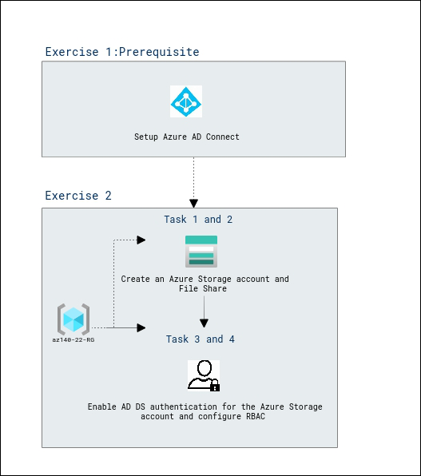


## Exercise 1: Prerequisite - Setup Azure AD Connect

1. From your lab computer, start a web browser, navigate to the [Azure portal]( ), and sign in by providing credentials of a user account with the Owner role in the subscription you will be using in this lab.

2. In the Azure portal, search for and select **Virtual machines** and, from the **Virtual machines** blade, select **az140-dc-vm11**.

3. On the **az140-dc-vm11** blade, select **Connect**.

4. On the **az140-dc-vm11| Connect** blade, select **Go to Bastion**.

   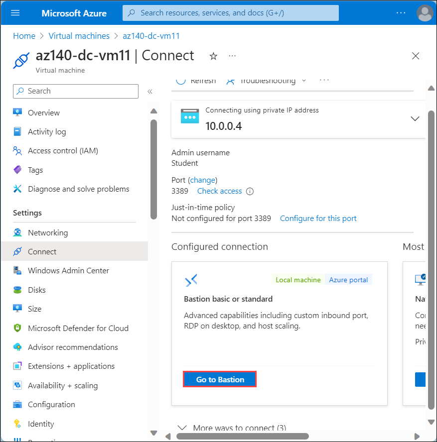

5. On the **Bastion** tab of the **az140-dc-vm11**, provide the following credentials for the **Connection Settings** and select **Connect (4)**:

   |Setting|Value|
   |---|---|
   |Username|**Student (1)**|
   |Authentication Type|**VM Password (2)**|    
   |Password|**Pa55w.rd1234 (3)**|

    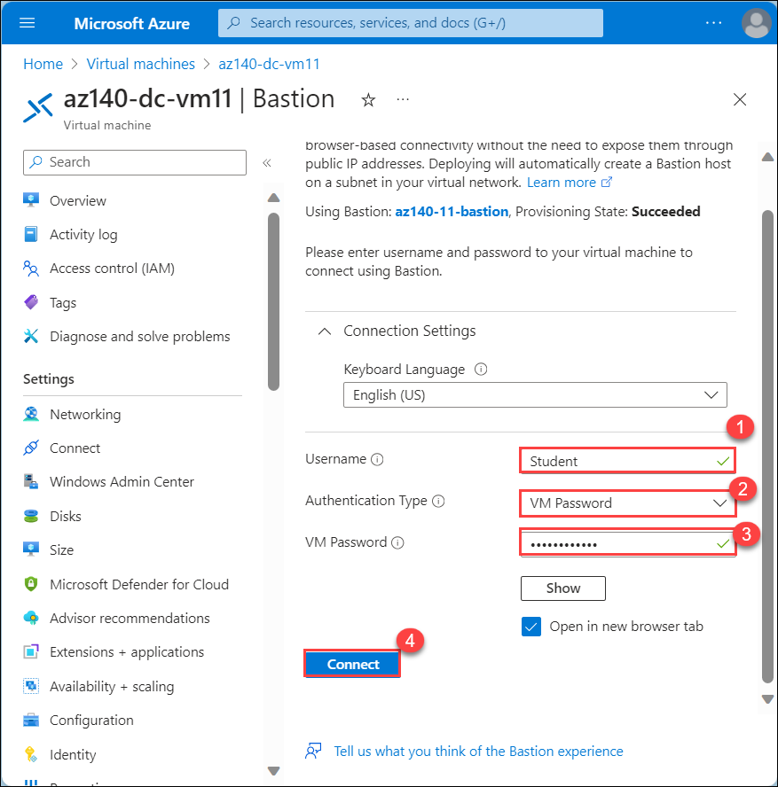


   **Note**: On clicking **Connect**, if you encounter an error **A popup blocker is preventing new window from opening. Please allow popups and retry**, then select the popup blocker icon at the top, select **Always allow pop-ups and redirects from https://portal.azure.com** and click on **Done**, and try connecting to the VM again.

   
  
   **Note**: If you are prompted **See text and images copied to the clipboard**, select **Allow**. 

6. Once logged in, a logon task will start executing. When prompted **Do you want PowerShell to install and import the Nuget provider now?** enter **Y** and hit enter.

   >**Note**: Wait for the logon task to complete and present you with **Microsoft Azure Active Directory Connect** wizard. This should take about 10 minutes. If the **Microsoft Azure Active Directory Connect** wizard is not presented to you after the logon task completes, then launch it manually by double-clicking the **Azure AD Connect** icon on the desktop.

7. On the **Welcome to Azure AD Connect** page of the **Microsoft Azure Active Directory Connect** wizard, select the checkbox **I agree to the license terms and privacy notice** and select **Continue**.

8. On the **Express Settings** page of the **Microsoft Azure Active Directory Connect** wizard, select the **Customize** option.

   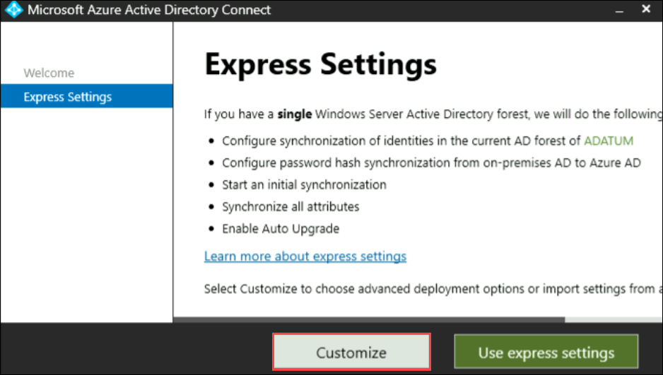

9. On the **Install required components** page, leave all optional configuration options deselected and select **Install**, and wait for 2 minutes to complete the installation.

   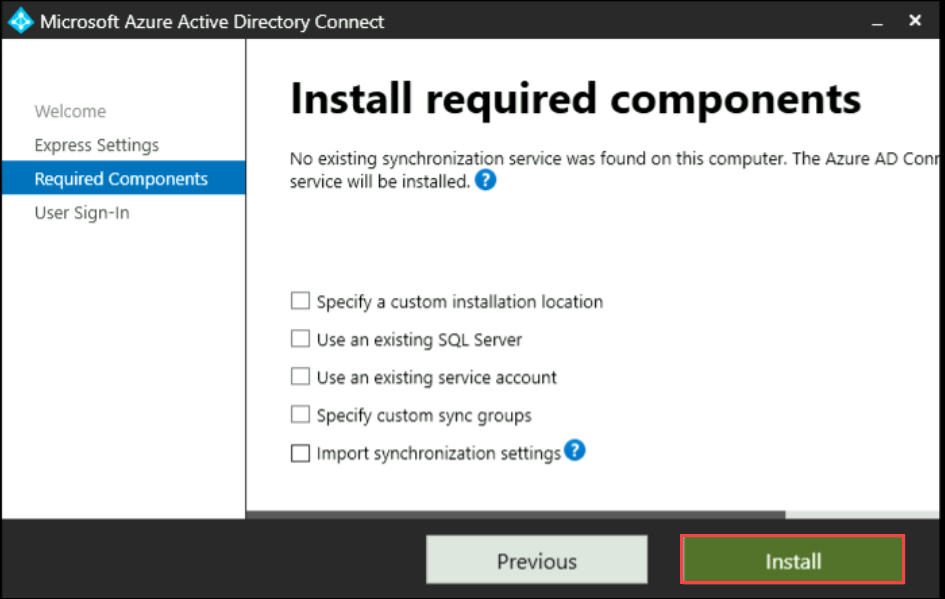

10. On the **User sign-in** page, ensure that only the **Password Hash Synchronization(1)** is enabled and select **Next(2)**.

    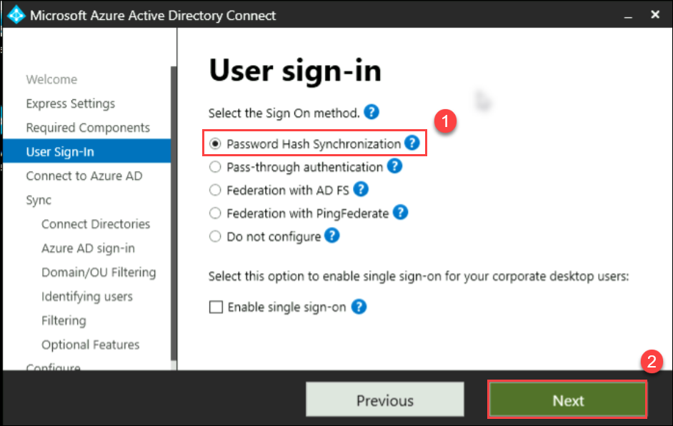

11. On the **Connect to Azure AD** page, authenticate by using the credentials of the **aadsyncuser** user account you created in the previous exercise and select **Next**.

    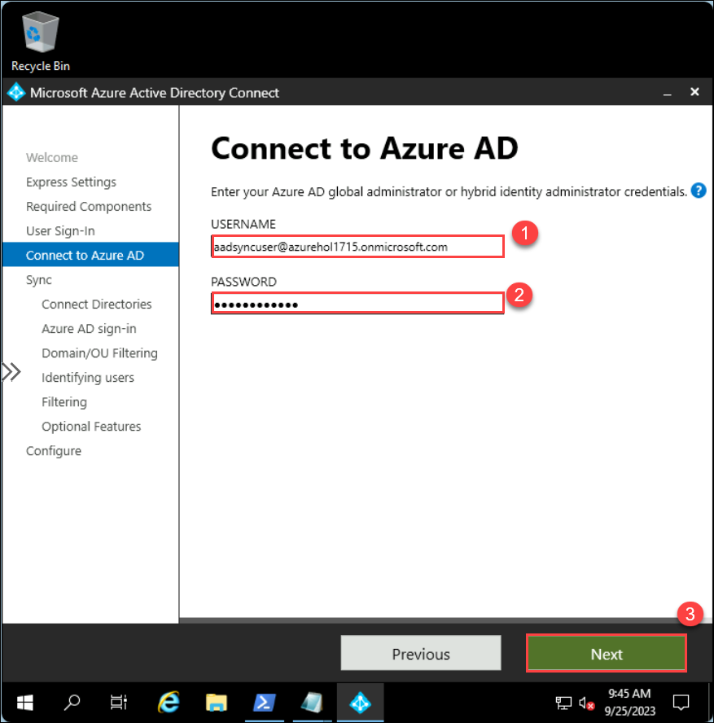

      > **Note**: Provide the userPrincipalName attribute of the **aadsyncuser** account available in the **LabValues** text file present on desktop and specify the password **Pa55w.rd1234**.

      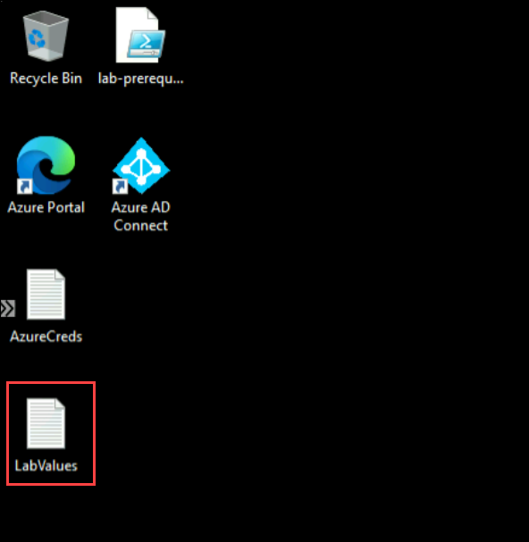

12. On the **Connect your directories** page, select the **Add Directory** button to the right of the **adatum.com** forest entry.

13. In the **AD forest account** window, ensure that the option to **Create new AD account** is selected, specify the following credentials, and select **OK**:

      |Setting|Value|
      |---|---|
      |User Name|**ADATUM\Student**|
      |Password|**Pa55w.rd1234**|

14. Back on the **Connect your directories** page, ensure that the **adatum.com** entry appears as a configured directory and select **Next**.

15. On the **Azure AD sign-in configuration** page, note the warning stating **Users will not be able to sign in to Azure AD with on-premises credentials if the UPN suffix does not match a verified domain name**, enable the checkbox **Continue without matching all UPN suffixes to verified domain**, and select **Next**.

     > **Note**: This is expected since the Azure AD tenant does not have a verified custom DNS domain matching one of the UPN suffixes of the **adatum.com** AD DS.

16. On the **Domain and OU filtering** page, select the option **Sync selected domains and OUs**, expand the adatum.com node, clear all checkboxes, select only the checkbox next to the **ToSync** OU, and select **Next**.

    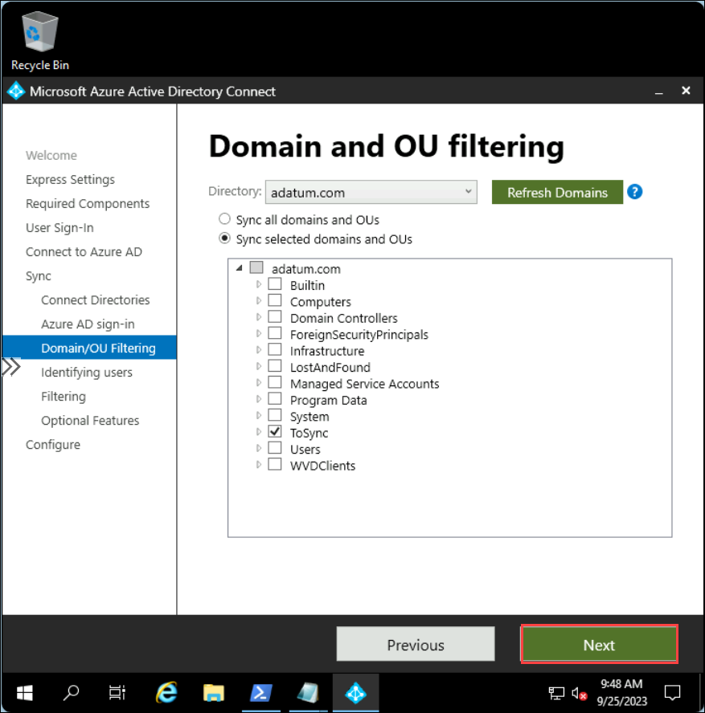

17. On the **Uniquely identifying your users** page, accept the default settings, and select **Next**.

18. On the **Filter users and devices** page, accept the default settings, and select **Next**.

19. On the **Optional features** page, accept the default settings, and select **Next**.

20. On the **Ready to configure** page, ensure that the **Start the synchronization process when configuration completes** checkbox is selected and select **Install**.
    
    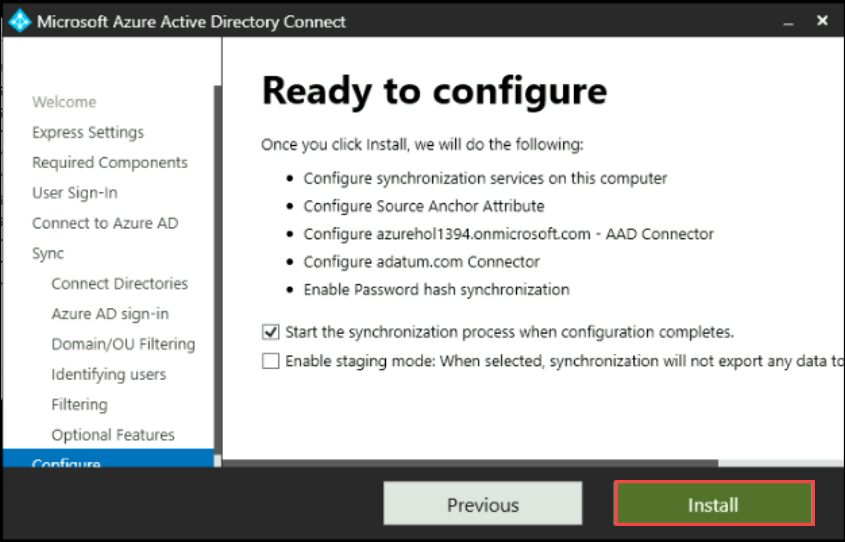

    > **Note**: Installation should take about 2 minutes.

21. Review the information on the **Configuration complete** page and select **Exit** to close the **Microsoft Azure Active Directory Connect** window.

    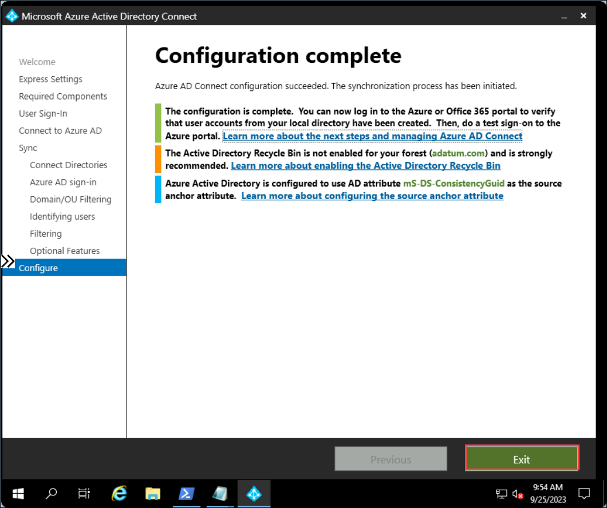

22. Within the Remote Desktop session to **az140-dc-vm11**, open the Microsoft Edge browser shortcut for Azure or navigate to the [Azure portal](https://portal.azure.com). If prompted, sign in by using the Azure AD credentials of the user account with the Owner role in the subscription you are using in this lab.

23. In the Azure portal, use the **Search resources, services, and docs** text box at the top of the Azure portal page, search for and navigate to the **Microsoft Entra ID** blade and, on your Azure AD tenant blade, in the **Manage** section of the hub menu, select **Users**.

24. On the **All users** blade, note that the list of user objects includes the listing of AD DS user accounts you created earlier in this lab, with the **Yes** entry appearing in the **Directory synced** column.

    > **Note**: You might have to wait a few minutes and refresh the browser page for the AD DS user accounts to appear. Proceed to the next step only if you are able to see the listing of AD DS user accounts you created. 

25. Within the Remote Desktop session to **az140-dc-vm11**, start **Windows PowerShell ISE** as administrator, and run the following to create an organizational unit that will host the computer objects of the Azure Virtual Desktop hosts:

      ```powershell
      New-ADOrganizationalUnit 'WVDInfra' –path 'DC=adatum,DC=com' -ProtectedFromAccidentalDeletion $false
      ```
 
## Exercise 2: Configure Azure Files to store profile containers for Azure Virtual Desktop

The main tasks for this exercise are as follows:

1. Create an Azure Storage account
1. Create an Azure Files share
1. Enable AD DS authentication for the Azure Storage account 
1. Configure the Azure Files RBAC-based permissions
1. Configure the Azure Files file system permissions

### Task 1: Create an Azure Storage account

1. From your lab computer, start a web browser, navigate to the [Azure portal](https://portal.azure.com), and sign in by providing credentials of a user account with the Owner role in the subscription you will be using in this lab.

1. In the Azure portal, search for and select **Resource group**, Click on **+ Create** and enter the name of the resource group as **az140-22-RG** and select the **Region** in which the **lab was deployed**, then select **Review + Create** and select **Create**.

1. In the Azure portal, search for and select **Virtual machines** and, from the **Virtual machines** blade, select **az140-dc-vm11**.

1. On the **az140-dc-vm11| Connect** blade,, select **Go to Bastion**.

1. On the **Bastion** tab of the **az140-dc-vm11**, provide the following credentials for the **Connection Settings** and select **Connect**:

   |Setting|Value|
   |---|---|
   |User Name|**Student@adatum.com**|
   |Authentication Type|**VM Password**|    
   |Password|**Pa55w.rd1234**|

1. Within the Remote Desktop session to **az140-dc-vm11**, start Microsoft Edge and navigate to the [Azure portal](https://portal.azure.com). If prompted, sign in by using the Azure AD credentials of the user account with the Owner role in the subscription you are using in this lab.

1. Within the Remote Desktop session to **az140-dc-vm11**, in the Microsoft Edge window displaying the Azure portal, search for and select **Storage accounts** and, on the **Storage accounts** blade, select **+ Create**.

1. On the **Basics** tab of the **Create storage account** blade, specify the following settings (leave others with their default values):

   |Setting|Value|
   |---|---|
   |Subscription|the name of the Azure subscription you are using in this lab|
   |Resource group|**az140-22-RG**|
   |Storage account name|`storage<DeploymentID>`. Replace `<DeploymentID>` placeholder with the DeploymentID value available in the lab guide's **Environment Details** tab
   |Region|the name of an Azure region hosting the Azure Virtual Desktop lab environment|
   |Performance|**Standard**|
   |Redundancy|**Geo-redundant storage (GRS)**|
   |Make read access to data available in the event of regional unavailability|enabled|

   >**Note**: Make sure that the length of the storage account name does not exceed 15 characters. The name will be used to create a computer account in the Active Directory Domain Services (AD DS) domain that is integrated with the Azure AD tenant associated with the Azure subscription containing the storage account. This will allow for AD DS-based authentication when accessing file shares hosted in this storage account.

1. On the **Basics** tab of the **Create storage account** blade, select **Review**, wait for the validation process to complete, and then select **Create**.

1. Monitor the deployment status on the deployment page. In a minute or so, you should see a confirmation of the successful deployment. Select **Go to resource**. This action will redirect you to the page.

   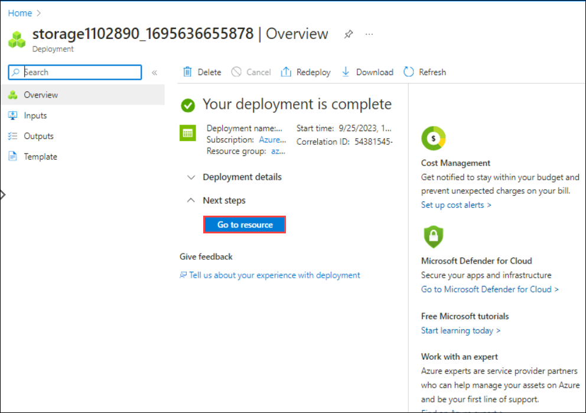

### Task 2: Create an Azure Files share

1. On the **Storage accounts** blade and select the entry representing the newly created storage account.

1. On the storage account blade, in the **Data storage** section, select **File shares** and then select **+ File share**.

1. On the **New file share** blade, specify the following settings and select **Review + Create** (leave other settings with their default values) wait for the validation process to complete, and then select **Create**.

   |Setting|Value|
   |---|---|
   |Name|**az140-22-profiles**|
   |Tiers|**Transaction optimized**|

### Task 3: Enable AD DS authentication for the Azure Storage account 

1. Within the Remote Desktop session to **az140-dc-vm11**, open another tab in the Microsoft Edge window, navigate to the [Azure Files samples GitHub repository](https://github.com/Azure-Samples/azure-files-samples/releases), download [the most recent version of the compressed **AzFilesHybrid.zip** PowerShell module, and extract its content into **C:\\Allfiles\\Labs\\02** folder (create the folders if needed).

   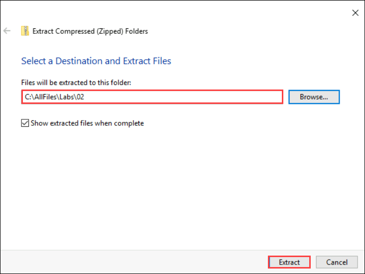

2. Within the Remote Desktop session to **az140-dc-vm11**, start **Windows PowerShell ISE** as administrator and, from the **Administrator: Windows PowerShell ISE** script pane, run the following to remove the **Zone.Identifier** alternate data stream, which has a value of **3**, indicating that it was downloaded from the Internet:

   ```powershell
   Get-ChildItem -Path C:\AllFiles\Labs\02 -File -Recurse | Unblock-File
   ```

3. From the **Administrator: Windows PowerShell ISE** console, run the following to sign in to your Azure subscription:

   ```powershell
   Connect-AzAccount
   ```

4. When prompted, sign in with the Azure AD credentials of the user account with the Owner role in the subscription you are using in this lab.

   > **Note**: If you see the pop-up Action Required, click **Ask Later.**

   > **Note**: If you get a **Windows Security Warning** popup asking "When you send information to the Internet, it might be possible for others to see that information. Do you want to continue?", select the checkbox **Don't show this message again** and select **Yes**.

5. Within the Remote Desktop session to **az140-dc-vm11**, from the **Administrator: Windows PowerShell ISE** script pane, run the following to set the variables necessary to run the subsequent script:

   ```powershell
   $subscriptionId = (Get-AzContext).Subscription.Id
   $resourceGroupName = 'az140-22-RG'
   $storageAccountName = (Get-AzStorageAccount -ResourceGroupName $resourceGroupName)[0].StorageAccountName
   ```

6. Within the Remote Desktop session to **az140-dc-vm11**, from the **Administrator: Windows PowerShell ISE** script pane, run the following to create an AD DS computer object that represents the Azure Storage account you created earlier in this task and is used to implement its AD DS authentication:

   ```powershell
   cd C:\AllFiles\Labs\02
   
   Set-Location -Path 'C:\AllFiles\Labs\02'
   .\CopyToPSPath.ps1 
   Import-Module -Name AzFilesHybrid
   Join-AzStorageAccountForAuth `
      -ResourceGroupName $ResourceGroupName `
      -StorageAccountName $StorageAccountName `
      -DomainAccountType 'ComputerAccount' `
      -OrganizationalUnitDistinguishedName 'OU=WVDInfra,DC=adatum,DC=com'
   ```
    >**Note**: If you receive an error when running this script block, ensure that you are in the same directory as the CopyToPSPath.ps1 script. Depending on how the   files were extracted earlier in this lab, they might be in a sub-folder named AzFilesHybrid. In the PowerShell context, change directories to the folder using **cd  AzFilesHybrid**.
    
    >**Note**: If you receive an error when running the script block stating **Service Principal already exists within AD** then you need to add  **-OverwriteExistingADObject** at the last of the script.
    
    >**Note**: If you get a **Set password on AD object storage** popup. Select **Yes to All**.

7. Within the Remote Desktop session to **az140-dc-vm11**, from the **Administrator: Windows PowerShell ISE** script pane, run the following to verify that the AD DS authentication is enabled on the Azure Storage account:

   ```powershell
   $storageaccount = Get-AzStorageAccount -ResourceGroupName $resourceGroupName -Name $storageAccountName
   $storageAccount.AzureFilesIdentityBasedAuth.ActiveDirectoryProperties
   $storageAccount.AzureFilesIdentityBasedAuth.DirectoryServiceOptions
   ```

8. Verify that the output of the command `$storageAccount.AzureFilesIdentityBasedAuth.ActiveDirectoryProperties` returns `AD`, representing the directory service of the storage account, and that the output of the `$storageAccount.AzureFilesIdentityBasedAuth.DirectoryServiceOptions` command, representing the directory domain information, resembles the following format (the values of `DomainGuid`, `DomainSid`, and `AzureStorageSid` will differ):

   ```
   DomainName        : adatum.com
   NetBiosDomainName : adatum.com
   ForestName        : adatum.com
   DomainGuid        : 47c93969-9b12-4e01-ab81-1508cae3ddc8
   DomainSid         : S-1-5-21-1102940778-2483248400-1820931179
   AzureStorageSid   : S-1-5-21-1102940778-2483248400-1820931179-2109
   ```
    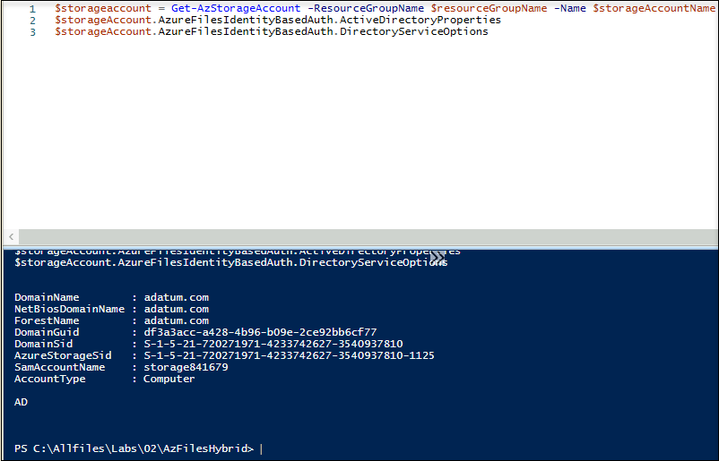
  

9. Within the Remote Desktop session to **az140-dc-vm11**, switch to the Microsoft Edge window displaying the Azure portal, on the blade displaying the storage account, select **File shares** and verify that the **Active Directory(SMB)** setting is **Configured**.

    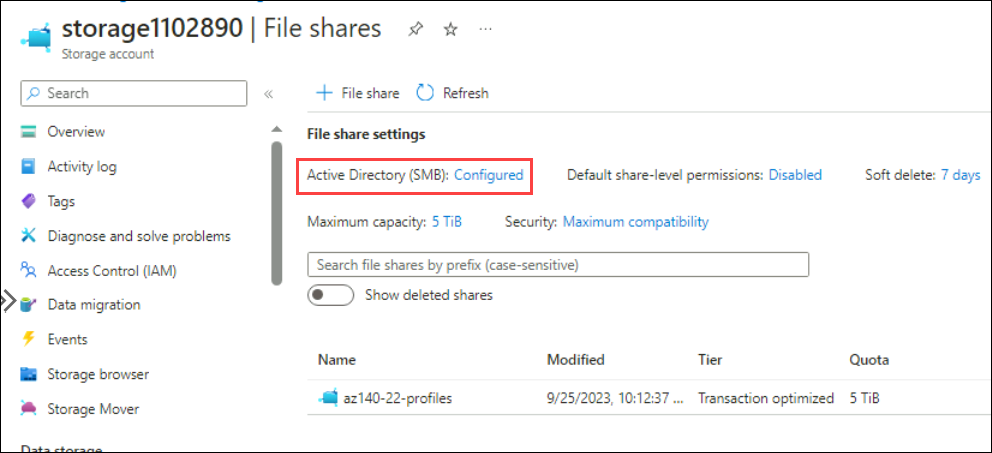

   >**Note**: You might have to refresh the browser page for the change to be reflected within the Azure portal.

### Task 4: Configure the Azure Files RBAC-based permissions

1. Within the Remote Desktop session to **az140-dc-vm11**, in the Microsoft Edge window displaying the Azure portal, on the blade displaying properties of the storage account you created earlier in this exercise, in the vertical menu on the left side, in the **Data storage** section, select **File shares**.

1. On the **File shares** blade, in the list of shares, select the **az140-22-profiles** entry.

1. On the **az140-22-profiles** blade, in the vertical menu on the left side, select **Access Control (IAM)**.

1. On the **Access Control (IAM)** blade of the storage account, select **+ Add** and, in the drop-down menu, select **Add role assignment**.

1. On the **Add role assignment** blade, specify the following settings and select **Review + assign**:

   |Setting|Value|
   |---|---|
   |Role|**Storage File Data SMB Share Contributor**|
   |Assign access to|**User, group, or service principal**|
   |Members|select **az140-wvd-users**|

    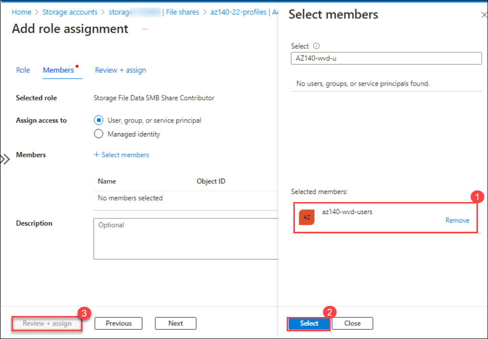

1. On the **Access Control (IAM)** blade of the storage account, select **+ Add** and, in the drop-down menu, select **Add role assignment**.

1. On the **Add role assignment** blade, specify the following settings and select **Review + assign**:

   |Setting|Value|
   |---|---|
   |Role|**Storage File Data SMB Share Elevated Contributor**|
   |Assign access to|**User, group, or service principal**|
   |Members|select **az140-wvd-admins**|

   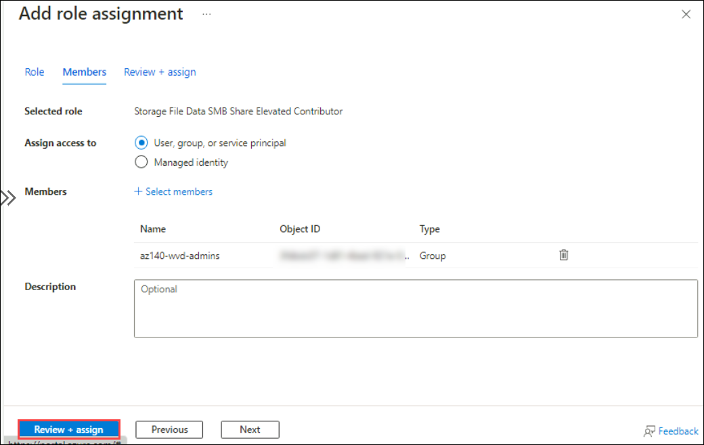

### Task 5: Configure the Azure Files file system permissions

1. Within the Remote Desktop session to **az140-dc-vm11**, switch to the **Administrator: Windows PowerShell ISE** window and, from the **Administrator: Windows PowerShell ISE** script pane, run the following to create a variable referencing the name and key of the storage account you created earlier in this exercise:

   ```powershell
   $resourceGroupName = 'az140-22-RG'
   $storageAccount = (Get-AzStorageAccount -ResourceGroupName $resourceGroupName)[0]
   $storageAccountName = $storageAccount.StorageAccountName
   $storageAccountKey = (Get-AzStorageAccountKey -ResourceGroupName $resourceGroupName -Name $storageAccountName).Value[0]
   ```

1. From the **Administrator: Windows PowerShell ISE** script pane, run the following to create a drive mapping to the file share you created earlier in this exercise:

   ```powershell
   $fileShareName = 'az140-22-profiles'
   net use Z: "\\$storageAccountName.file.core.windows.net\$fileShareName" /u:AZURE\$storageAccountName $storageAccountKey
   ```

1. From the **Administrator: Windows PowerShell ISE** console, run the following to view the current file system permissions:

   ```powershell
   icacls Z:
   ```

   >**Note**: By default, both **NT Authority\\Authenticated Users** and **BUILTIN\\Users** have permissions that would allow users read other users' profile containers. You will remove them and add minimum required permissions instead.

1. From the **Administrator: Windows PowerShell ISE** script pane, run the following to adjust the file system permissions to comply with the principle of least privilege:

   ```powershell
   $permissions = 'ADATUM\az140-wvd-admins'+':(F)'
   cmd /c icacls Z: /grant $permissions
   $permissions = 'ADATUM\az140-wvd-users'+':(M)'
   cmd /c icacls Z: /grant $permissions
   $permissions = 'Creator Owner'+':(OI)(CI)(IO)(M)'
   cmd /c icacls Z: /grant $permissions
   icacls Z: /remove 'Authenticated Users'
   icacls Z: /remove 'Builtin\Users'
   ```

   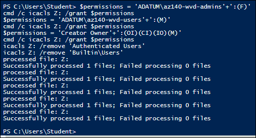

   >**Note**: Alternatively, you could set permissions by using File Explorer.

   > **Congratulations** on completing the task! Now, it's time to validate it. Here are the steps:
   > - Navigate to the Lab Validation Page, from the upper right corner in the lab guide section.
   > - Hit the Validate button for the corresponding task. If you receive a success message, you can proceed to the next task. 
   > - If not, carefully read the error message and retry the step, following the instructions in the lab guide.
   > - If you need any assistance, please contact us at labs-support@spektrasystems.com. We are available 24/7 to help.

   ### Review
   In this lab, you have completed the following:
   - Setup Azure AD Connect
   - Configuration of  Azure Files to store profile containers for Azure Virtual Desktop
   
## You have successfully completed the lab
