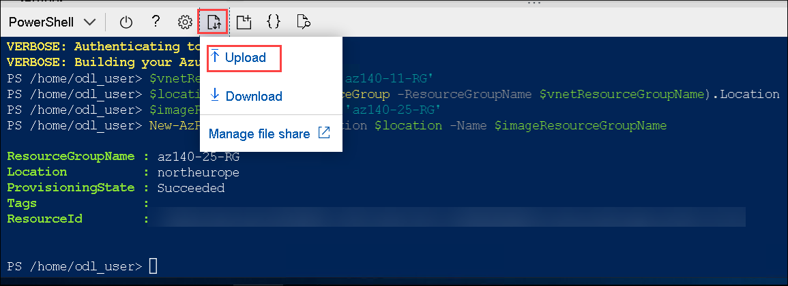

# Module 06 - Create and manage session host images (AD DS)

## Estimated timing: 60 minutes

## Exercise 1: Prerequisite - Setup Azure AD Connect

1. In the Azure portal, search for and select **Virtual machines** and, from the **Virtual machines** blade, select **az140-dc-vm11**.
   
2. On the **az140-dc-vm11** blade, select **Connect**, and select **Bastion**, on the **Bastion** tab of the **az140-dc-vm11 \| Connect** blade, select **Use Bastion**.
   
3. On the **Bastion** tab of the **az140-dc-vm11**, when prompted, provide the following credentials and select **Connect**:

   |Setting|Value|
   |---|---|
   |User Name|**Student**|
   |Password|**Pa55w.rd1234**|

   >**Note**: On clicking **Connect**, if you encounter an error **A popup blocker is preventing new window from opening. Please allow popups and retry**, then select the popup blocker icon at the top, select **Always allow pop-ups and redirects from https://portal.azure.com** and click on **Done**, and try connecting to the VM again.
  
   >**Note**: If you are prompted **See text and images copied to the clipboard**, select **Allow**. 

4. Once logged in, a logon task will start executing. When prompted **Do you want PowerShell to install and import the Nuget provider now?** enter **Y** and hit enter.
   
   >**Note**: Wait for the logon task to complete and present you with **Microsoft Azure Active Directory Connect** wizard. This should take about 10 minutes. If the **Microsoft Azure Active Directory Connect** wizard is not presented to you after the logon task completes, then launch it manually by double clicking the **Azure AD Connect** icon on the desktop.

5. On the **Welcome to Azure AD Connect** page of the **Microsoft Azure Active Directory Connect** wizard, select the checkbox **I agree to the license terms and privacy notice** and select **Continue**.
   
6. On the **Express Settings** page of the **Microsoft Azure Active Directory Connect** wizard, select the **Customize** option.
    
7. On the **Install required components** page, leave all optional configuration options deselected and select **Install**.
    
8. On the **User sign-in** page, ensure that only the **Password Hash Synchronization** is selected and click **Next**.
    
9. On the **Connect to Azure AD** page, authenticate by using the credentials of the **aadsyncuser** user account and select **Next**. 

    >**Note**: Provide the userPrincipalName attribute of the **aadsyncuser** account available in the **LabValues** text file present on desktop and specify the password **Pa55w.rd1234**.

10. On the **Connect your directories** page, select the **Add Directory** button to the right of the **adatum.com** forest entry.
    
11. In the **AD forest account** window, ensure that the option to **Create new AD account** is selected, specify the following credentials, and select **OK**:

      |Setting|Value|
      |---|---|
      |User Name|**ADATUM\Student**|
      |Password|**Pa55w.rd1234**|

12. Back on the **Connect your directories** page, ensure that the **adatum.com** entry appears as a configured directory and select **Next**.
    
13. On the **Azure AD sign-in configuration** page, note the warning stating **Users will not be able to sign-in to Azure AD with on-premises credentials if the UPN suffix does not match a verified domain name**, enable the checkbox **Continue without matching all UPN suffixes to verified domain**, and select **Next**.

    >**Note**: This is expected, since the Azure AD tenant does not have a verified custom DNS domain matching one of the UPN suffixes of the **adatum.com** AD DS.

14. On the **Domain and OU filtering** page, select the option **Sync selected domains and OUs**, expand the adatum.com node, clear all checkboxes, select only the checkbox next to the **ToSync** OU, and select **Next**.
    
15. On the **Uniquely identifying your users** page, accept the default settings, and select **Next**.
    
16. On the **Filter users and devices** page, accept the default settings, and select **Next**.
    
17. On the **Optional features** page, accept the default settings, and select **Next**.
    
18. On the **Ready to configure** page, ensure that the **Start the synchronization process when configuration completes** checkbox is selected and select **Install**.

    >**Note**: Installation should take about 2 minutes.

19. Review the information on the **Configuration complete** page and select **Exit** to close the **Microsoft Azure Active Directory Connect** window.

20. Within the Bastion session to **az140-dc-vm11**, open Microsoft Edge browser shortcut for Azure or navigate to the [Azure portal](https://portal.azure.com). If prompted, sign in by using following Azure AD credentials of the user account with the Owner role in the subscription you are using in this lab.

      * Email/Username: <inject key="AzureAdUserEmail"></inject>

      * Password: <inject key="AzureAdUserPassword"></inject>
    
22. In the Azure portal, use the **Search resources, services, and docs** text box at the top of the Azure portal page, search for and navigate to the **Azure Active Directory** blade and, on your Azure AD tenant blade, in the **Manage** section of the hub menu, select **Users**.
    
23. On the **All users (Preview)** blade, note that the list of user objects includes the listing of AD DS user accounts you created earlier in this lab, with the **Yes** entry appearing in the **On-premises sync enabled** column.

    >**Note**: You might have to wait a few minutes and refresh the browser page for the AD DS user accounts to appear. Proceed to next step only if you are able to see the listing of AD DS user accounts you created. 

24. Within the Bastion session to **az140-dc-vm11**, start **Windows PowerShell ISE** as administrator, and run the following to create an organizational unit that will host the computer objects of the Azure Virtual Desktop hosts:

      ```powershell
      New-ADOrganizationalUnit 'WVDInfra' –path 'DC=adatum,DC=com' -ProtectedFromAccidentalDeletion $false
      ```


## Exercise 2: Create and manage session host images
  
The main tasks for this exercise are as follows:

1. Prepare for configuration of a Azure Virtual Desktop host image
1. Deploy Azure Bastion
1. Configure a Azure Virtual Desktop host image
1. Create a Azure Virtual Desktop host image
1. Provision a Azure Virtual Desktop host pool by using the custom image

### Task 1: Prepare for configuration of a Azure Virtual Desktop host image

1. From your lab Virtual machine, start a web browser, navigate to the [Azure portal](https://portal.azure.com), and sign in by providing credentials of a user account with the Owner role in the subscription you will be using in this lab.

     * Email/Username: <inject key="AzureAdUserEmail"></inject>

     * Password: <inject key="AzureAdUserPassword"></inject>
   
1. In the Azure portal, open **Cloud Shell** pane by selecting on the toolbar icon directly to the right of the search textbox.
   
1. If prompted to select either **Bash** or **PowerShell**, select **PowerShell** and then select **Create storage**.
   
1. On the lab computer, in the web browser displaying the Azure portal, from the PowerShell session in the Cloud Shell pane, run the following to create a resource group that will contain the Azure Virtual Desktop host image:

   ```powershell
   $vnetResourceGroupName = 'az140-11-RG'
   $location = (Get-AzResourceGroup -ResourceGroupName $vnetResourceGroupName).Location
   $imageResourceGroupName = 'az140-25-RG'
   New-AzResourceGroup -Location $location -Name $imageResourceGroupName
   ```

1. In the Azure portal, in the toolbar of the Cloud Shell pane, select the **Upload/Download files** icon, in the drop-down menu select **Upload**, navigate to the path **C:\AllFiles\AZ-140-Configuring-and-Operating-Microsoft-Azure-Virtual-Desktop\Allfiles\Labs\02** in the **Open** window, and select the files one after the another **az140-25_azuredeployvm25.json** and **az140-25_azuredeployvm25.parameters.json** and select **Open**. This will upload the files into the Cloud Shell home directory.

    

1. From the PowerShell session in the Cloud Shell pane, run the following to deploy an Azure VM running Windows 10 that will serve as a Azure Virtual Desktop client into the newly created subnet:

   ```powershell
   New-AzResourceGroupDeployment `
     -ResourceGroupName $imageResourceGroupName `
     -Name az140lab0205vmDeployment `
     -TemplateFile $HOME/az140-25_azuredeployvm25.json `
     -TemplateParameterFile $HOME/az140-25_azuredeployvm25.parameters.json
   ```

   >**Note**: Wait for the deployment to complete before you proceed to the next exercise. The deployment might take about 10 minutes.

### Task 2: Deploy Azure Bastion 

>**Note**: Azure Bastion allows for connection to the Azure VMs without public endpoints which you deployed in the previous task of this exercise, while providing protection against brute force exploits that target operating system level credentials.

>**Note**: Ensure that your browser has the pop-up functionality enabled.

1. In the browser window displaying the Azure portal, open another tab and, in the browser tab, navigate to the Azure portal.
   
1. In the Azure portal, open **Cloud Shell** pane by selecting on the toolbar icon directly to the right of the search textbox.
   
1. From the PowerShell session in the Cloud Shell pane, run the following to add a subnet named **AzureBastionSubnet** to the virtual network named **az140-25-vnet**:

   ```powershell
   $resourceGroupName = 'az140-25-RG'
   $vnet = Get-AzVirtualNetwork -ResourceGroupName $resourceGroupName -Name 'az140-25-vnet'
   $subnetConfig = Add-AzVirtualNetworkSubnetConfig `
     -Name 'AzureBastionSubnet' `
     -AddressPrefix 10.25.254.0/24 `
     -VirtualNetwork $vnet
   $vnet | Set-AzVirtualNetwork
   ```

1. Close the Cloud Shell pane.
   
1. In the Azure portal, search for and select **Bastions** and, from the **Bastions** blade, select **+ Create**.
   
1. On the **Basic** tab of the **Create a Bastion** blade, specify the following settings and select **Review + create**:

   |Setting|Value|
   |---|---|
   |Subscription|the name of the Azure subscription you are using in this lab|
   |Resource group|**az140-25-RG**|
   |Name|**az140-25-bastion**|
   |Region|the same Azure region to which you deployed the resources in the previous tasks of this exercise i.e. region same as your resource group|
   |Tier|**Basic**|
   |Virtual network|**az140-25-vnet**|
   |Subnet|**AzureBastionSubnet (10.25.254.0/24)**|
   |Public IP address|**Create new**|
   |Public IP name|**az140-25-vnet-ip**|

1. On the **Review + create** tab of the **Create a Bastion** blade, select **Create**:

   >**Note**: Wait for the deployment to complete before you proceed to the next exercise. The deployment might take about 15 minutes.

### Task 3: Configure a Azure Virtual Desktop host image

1. In the Azure portal, search for and select **Virtual machines** and, on the **Virtual machines** blade, select **az140-25-vm0**.
   
3. On the **az140-25-vm0** blade, select **Connect**, and select **Bastion**, on the **Bastion** tab of the **az140-25-vm0 \| Connect** blade, select **Use Bastion**.
   
5. When prompted, provde the following credentials and select **Connect**:

   |Setting|Value|
   |---|---|
   |User Name|**Student**|
   |Password|**Pa55w.rd1234**|

    >**Note**: If you see the Networks window **Do you want your PC to be discoverable by other Pcs and devices on this network?**, close it by selecting **No**.
  
    >**Note**: Close the **Server Manager** window/program. 

    >**Note**: If you get **Microsoft Teams: Get Started** window, close it. 

    >**Note**: You will start by installing FSLogix binaries.

6. Within the Bastion session to **az140-25-vm0**, start **Windows PowerShell ISE** as administrator.
   
8. Within the Bastion session to **az140-25-vm0**, from the **Administrator: Windows PowerShell ISE** console, run the following to create a folder you will use as a temporary location for configuration of the image:

   ```powershell
   New-Item -Type Directory -Path 'C:\Allfiles\Labs\02' -Force
   ```

9. Within theBastion session to **az140-25-vm0**, start Microsoft Edge, browse to [FSLogix download page](https://aka.ms/fslogix_download) , which will download FSLogix compressed file. Then, extract the zip file contents into the **C:\\Allfiles\\Labs\\02** folder.

10. Within the Bastion session to **az140-25-vm0**, switch to the **Administrator: Windows PowerShell ISE** window and, from the **Administrator: Windows PowerShell ISE** console, run the following to perform per-machine installation of OneDrive:

      ```powershell
      Start-Process -FilePath 'C:\Allfiles\Labs\02\x64\Release\FSLogixAppsSetup.exe' -ArgumentList '/quiet' -Wait
      ```

      >**Note**: Wait for the installation to complete. This might take about 1 minute. If the installation triggers a reboot, re-connect to **az140-25-vm0**.

      >**Note**: Next, you will step through installation and configuration of Microsoft Teams (for learning purposes, since Teams are already present on the image used for this lab).

11. Within the Bastion session to **az140-25-vm0**, right-click **Start**, in the right-click menu, select **Run**, in the **Run** dialog box, in the **Open** textbox, type **cmd** and press the **Enter** key to start **Command Prompt**.
    
13. In the **Administrator: C:\windows\system32\cmd.exe** window, from the command prompt, run the following to prepare for per-machine installation of Microsoft Teams:

      ```cmd
      reg add "HKLM\Software\Microsoft\Teams" /v IsWVDEnvironment /t REG_DWORD /d 1 /f
      ```

11. Within the Bastion session to **az140-25-vm0**, in Microsoft Edge, browse to [the download page of Microsoft Visual C++ Redistributable](https://aka.ms/vs/16/release/vc_redist.x64.exe), once the file is downloaded, copy **VC_redist.x64** into the **C:\\Allfiles\\Labs\\02** folder.

12. Within the Bastion session to **az140-25-vm0**, switch to the **Administrator: C:\windows\system32\cmd.exe** window and, from the command prompt, run the following to perform installation of Microsoft Visual C++ Redistributable:

      ```cmd
      C:\Allfiles\Labs\02\vc_redist.x64.exe /install /passive /norestart /log C:\Allfiles\Labs\02\vc_redist.log
      ```

12. Within the Bastion session to **az140-25-vm0**, in Microsoft Edge, browse to the documentation page titled [
Deploy the Teams desktop app to the VM](https://docs.microsoft.com/en-us/microsoftteams/teams-for-vdi#deploy-the-teams-desktop-app-to-the-vm), click the **64-bit version** link. Once the file is downloaded, copy the **Teams_windows_x64.msi** file into the **C:\\Allfiles\\Labs\\02** folder.

13. Within the Bastion session to **az140-25-vm0**, switch to the **Administrator: C:\windows\system32\cmd.exe** window and, from the command prompt, run the following to perform per-machine installation of Microsoft Teams:
   
      ```cmd
      msiexec /i C:\Allfiles\Labs\02\Teams_windows_x64.msi /l*v C:\Allfiles\Labs\02\Teams.log ALLUSER=1
      ```

      >**Note**: The installer supports the ALLUSER=1 and ALLUSERS=1 parameters. The ALLUSER=1 parameter is intended for per-machine installation in VDI environments. The ALLUSERS=1 parameter can be used in non-VDI and VDI environments.
      
      >**Note** if you encounter an error stating **Another version of the product is already installed**, then complete the following steps: Go to **Control Panel > Programs > Programs and Features** Right-click on the **Teams Machine-Wide Installer** program and select **Uninstall**. Proceed with removal of the program, and rerun step 13 above. 

14. Within the Bastion session to **az140-25-vm0**, start the **Windows PowerShell ISE** as Administrator and, from the **Administrator: Windows PowerShell ISE** console, run the following to install Microsoft Edge Chromium (for learning purposes, since Edge is already present on the image used for this lab).:

      ```powershell
      Start-BitsTransfer -Source "https://aka.ms/edge-msi" -Destination 'C:\Allfiles\Labs\02\MicrosoftEdgeEnterpriseX64.msi'
      Start-Process -Wait -Filepath msiexec.exe -Argumentlist "/i C:\Allfiles\Labs\02\MicrosoftEdgeEnterpriseX64.msi /q"
      ```

      >**Note**: Wait for the installation to complete. This might take about 2 minutes.

      >**Note**: When operating in a multi-language environment, you might need to install language packs. For details regarding this procedure, refer to the Microsoft Docs article [Add language packs to a Windows 10 multi-session image](https://docs.microsoft.com/en-us/azure/virtual-desktop/language-packs).

      >**Note**: Next, you will disable Windows Automatic Updates, disable Storage Sense, configure time zone redirection, and configure collection of telemetry. In general, you should first apply all current updates first. In this lab, you skip this step in order to minimize the duration of the lab.

15. Within the Bastion session to **az140-25-vm0**, switch to the **Administrator: C:\windows\system32\cmd.exe** window and, from the command prompt, run the following to disable Automatic Updates:
   
      ```cmd
      reg add "HKLM\SOFTWARE\Policies\Microsoft\Windows\WindowsUpdate\AU" /v NoAutoUpdate /t REG_DWORD /d 1 /f
      ```

16. In the **Administrator: C:\windows\system32\cmd.exe** window, from the command prompt, run the following to disable Storage Sense:

      ```cmd
      reg add "HKCU\Software\Microsoft\Windows\CurrentVersion\StorageSense\Parameters\StoragePolicy" /v 01 /t REG_DWORD /d 0 /f
      ```

17. In the **Administrator: C:\windows\system32\cmd.exe** window, from the command prompt, run the following to configure time zone redirection:

      ```cmd
      reg add "HKLM\SOFTWARE\Policies\Microsoft\Windows NT\Terminal Services" /v fEnableTimeZoneRedirection /t REG_DWORD /d 1 /f
      ```

18. In the **Administrator: C:\windows\system32\cmd.exe** window, from the command prompt, run the following to disable feedback hub collection of telemetry data:

      ```cmd
      reg add "HKLM\SOFTWARE\Policies\Microsoft\Windows\DataCollection" /v AllowTelemetry /t REG_DWORD /d 0 /f
      ```

### Task 4: Create a Azure Virtual Desktop host image

1. Within the Bastion session to **az140-25-vm0**, in the **Administrator: C:\windows\system32\cmd.exe** window, from the command prompt, run the sysprep utility in order to prepare the operating system for generating an image and automatically shut it down:

      ```cmd
      C:\Windows\System32\Sysprep\sysprep.exe /oobe /generalize /shutdown /mode:vm
      ```

      >**Note**: Wait for the sysprep process to complete. This might take about 2 minutes. This will automatically shut down the operating system. 

1. From your lab computer, in the web browser displaying the Azure portal, search for and select **Virtual machines** and, from the **Virtual machines** blade, select **az140-25-vm0**.
   
1. On the **az140-25-vm0** blade, in the toolbar above the **Essentials** section, click **Refresh**, verify that the **Status** of the Azure VM changed to **Stopped**, click **Stop**, and, when prompted for confirmation, click **OK** to transition the Azure VM into the **Stopped (deallocated)** state.
   
1. On the **az140-25-vm0** blade, verify that the **Status** of the Azure VM changed to the **Stopped (deallocated)** state and, in the toolbar, click **Capture**. This will automatically display the **Create an image** blade.
   
1. On the **Basics** tab of the **Create an image** blade, specify the following settings:

   |Setting|Value|
   |---|---|
   |Share image to Azure compute gallery|**Yes, share it to a gallery as an image version**|
   |Automatically delete this virtual machine after creating the image|checkbox cleared|
   |Target Azure compute gallery|**Create new** gallery with name **az14025imagegallery**|
   |Operating system state|**Generalized**|

1. On the **Basics** tab of the **Create an image** blade, below the **Target VM image definition** textbox, click **Create new**.
   
1. On the **Create a VM image definition**, specify the following settings and click **OK**:

   |Setting|Value|
   |---|---|
   |VM Image definition name|**az140-25-host-image**|
   |Publisher|**MicrosoftWindowsDesktop**|
   |Offer|**office-365**|
   |SKU|**20h1-evd-o365pp**|

1. Back on the **Basics** tab of the **Create an image** blade, specify the following settings and click **Review + create**:

   |Setting|Value|
   |---|---|
   |Version number|**1.0.0**|
   |Exclude from latest|checkbox cleared|
   |End of life date|one year ahead from the current date|
   |Default replica count|**1**|
   |Target region replica count|**1**|
   |Storage account type|**Premium SSD LRS**|

1. On the **Review + create** tab of the **Create an image** blade, click **Create**.

   >**Note**: Wait for the deployment to complete. This might take about 20 minutes.

1. From your lab computer, in the web browser displaying the Azure portal, search for and select **Azure compute galleries** and, on the **Azure compute galleries** blade, select the **az14025imagegallery** entry, and on the **az14025imagegallery**'s **Overview** blade, scroll down to the **Definitions** tab and verify the presence of the **az140-25-host-image** entry representing the newly created image.

### Task 5: Provision a Azure Virtual Desktop host pool by using a custom image

1. From the lab computer, in the Azure portal, use the **Search resources, services, and docs** text box at the top of the Azure portal page to search for and navigate to **Virtual networks** and, on the **Virtual networks** blade, select **az140-adds-vnet11**. 

1. On the **az140-adds-vnet11** blade, select **Subnets** from the vertical menu in the left side, on the **Subnets** blade, select **+ Subnet**, on the **Add subnet** blade, specify the following settings (leave all other settings with their default values) and click **Save**:

   |Setting|Value|
   |---|---|
   |Name|**hp4-Subnet**|
   |Subnet address range|**10.0.4.0/24**|

1. From the lab computer, in the Azure portal, in the web browser window displaying the Azure portal, search for and select **Azure Virtual Desktop**, on the **Azure Virtual Desktop** blade, under **Manage** section, select **Host pools** and, on the **Azure Virtual Desktop \| Host pools** blade, select **+ Create**. 

1. On the **Basics** tab of the **Create a host pool** blade, specify the following settings and select **Next: Virtual Machines >**:

   |Setting|Value|
   |---|---|
   |Subscription|the name of the Azure subscription you are using in this lab|
   |Resource group|**az140-25-RG**|
   |Host pool name|**az140-25-hp4**|
   |Location|the name of the Azure region into which you deployed resources in the first exercise of this lab|
   |Validation environment|**No**|
   |Host pool type|**Pooled**|
   |Load balancing algorithm|**Breadth-first**|
   |Max session limit|**50**|

1. On the **Virtual machines** tab of the **Create a host pool** blade, specify the following settings:

   |Setting|Value|
   |---|---|
   |Add Azure virtual machines|**Yes**|
   |Resource group|**Defaulted to same as host pool**|
   |Name prefix|**az140-25-p4**|
   |Virtual machine location|the name of the Azure region into which you deployed resources in the first exercise of this lab|
   |Availability options|No infrastructure redundancy required|
   |Security Type|Standard|
   

1. On the **Virtual machines** tab of the **Create a host pool** blade, directly below the **Image** dropdown list, click the **See all images** link.
   
1. On the Select an image blade, under Other Items, click Shared Images, and, in the list of shared images, select **az140-25-host-image**.
   
1. Back on the **Virtual machines** tab of the **Create a host pool** blade, specify the following settings and select **Next: Workspace >**

   |Setting|Value|
   |---|---|
   |Virtual machine size|**Standard D2s v3**|
   |Number of VMs|**1**|
   |OS disk type|**Standard SSD**|
   |Virtual network|**az140-adds-vnet11**|
   |Subnet|**hp4-Subnet (10.0.4.0/24)**|
   |Network security group|**Basic**|
   |Public inbound ports|**Yes**|
   |Inbound ports to allow|**RDP**|
   |AD domain join UPN|**student@adatum.com**|
   |Password|**Pa55w.rd1234**|
   |Specify domain or unit|**Yes**|
   |Domain to join|**adatum.com**|
   |Organizational Unit path|**OU=WVDInfra,DC=adatum,DC=com**|
   |User name|Student|
   |Password|Pa55w.rd1234|
   |Confirm password|Pa55w.rd1234|

1. On the **Workspace** tab of the **Create a host pool** blade, specify the following settings and select **Review + create**:

   |Setting|Value|
   |---|---|
   |Register desktop app group|**No**|

1. On the **Review + create** tab of the **Create a host pool** blade, select **Create**.

   >**Note**: Wait for the deployment to complete. This might take about 10 minutes.
   
   >**Note** If the deployment fails due to the quota limit being reached, perform the steps spelled out in the first lab to automatically request quota increase of the Standard D2sv3 limit to 30.

   >**Note**: Following deployment of hosts based on custom images, you should consider running the Virtual Desktop Optimization Tool, available from [its GitHub repository](https://github.com/The-Virtual-Desktop-Team/).

   **Congratulations** on completing the task! Now, it's time to validate it. Here are the steps:
     > - Navigate to the Lab Validation Page, from the upper right corner in the lab guide section.
     > - Hit the Validate button for the corresponding task. If you receive a success message, you can proceed to the next task. 
     > - If not, carefully read the error message and retry the step, following the instructions in the lab guide.
     > - If you need any assistance, please contact us at labs-support@spektrasystems.com. 

    **You have successfully completed the lab**

