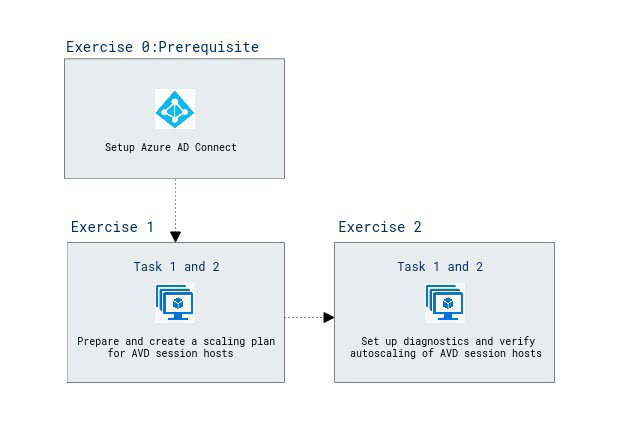

# Module 09 - Implement autoscaling in host pools (AD DS)

## Lab scenario

You need to configure autoscaling of Azure Virtual Desktop session hosts in an Active Directory Domain Services (AD DS) environment.

## Lab Objectives
  
After completing this lab, you will be able to:

- Configure autoscaling of Azure Virtual Desktop session hosts
- Verify autoscaling of Azure Virtual Desktop session hosts


## Estimated Timing: 60 minutes

## Architecture Diagram
  
  

### Exercise 0: Prerequisite - Setup Azure AD Connect
1. In the Azure portal, search for and select **Virtual machines** and, from the **Virtual machines** blade, select **az140-dc-vm11**.
2. On the **az140-dc-vm11** blade, select **Connect**, in the drop-down menu, select **Bastion**.
3. On the **Bastion** tab of the **az140-dc-vm11**, when prompted, provide the following credentials and select **Connect**:

   |Setting|Value|
   |---|---|
   |User Name|**Student**|
   |Password|**Pa55w.rd1234**|

   > **Note**: On clicking **Connect**, if you encounter an error **A popup blocker is preventing new window from opening. Please allow popups and retry**, then select the popup blocker icon at the top, select **Always allow pop-ups and redirects from https://portal.azure.com** click on **Done**, and try connecting to the VM again.
  
   > **Note**: If you are prompted **See text and images copied the to the clipboard**, select **Allow**. 

4. Once logged in, a logon task will start executing. When prompted **Do you want PowerShell to install and import the Nuget provider now?** enter **Y** and hit enter.
   > **Note**: Wait for thdouble-clicking complete and present you with **Microsoft Azure Active Directory Connect** wizard. This should take about 10 minutes. If the **Microsoft Azure Active Directory Connect** wizard is not presented to you after the logon task completes, then launch it manually by double clicking the **Azure AD Connect** icon on the desktop.

5. On the **Welcome to Azure AD Connect** page of the **Microsoft Azure Active Directory Connect** wizard, select the checkbox **I agree to the license terms and privacy notice** and select **Continue**.
6. On the **Express Settings** page of the **Microsoft Azure Active Directory Connect** wizard, select the **Customize** option.
7. On the **Install required components** page, leave all optional configuration options deselected and select **Install**.
8. On the **User sign-in** page, ensure that only the **Password Hash Synchronization** is enabled and select **Next**.
9. On the **Connect to Azure AD** page, authenticate by using the credentials of the **aadsyncuser** user account you created in the previous exercise and select **Next**. 

   > **Note**: Provide the userPrincipalName attribute of the **aadsyncuser** account available in the **LabValues** text file present on desktop and specify the password **Pa55w.rd1234**.

10. On the **Connect your directories** page, select the **Add Directory** button to the right of the **adatum.com** forest entry.
11. In the **AD forest account** window, ensure that the option to **Create new AD account** is selected, specify the following credentials, and select **OK**:

    |Setting|Value|
    |---|---|
    |User Name|**ADATUM\Student**|
    |Password|**Pa55w.rd1234**|

12. Back on the **Connect your directories** page, ensure that the **adatum.com** entry appears as a configured directory and select **Next**
13. On the **Azure AD sign-in configuration** page, note the warning statig **Users will not be able to sign in to Azure AD with on-premises credentials if the UPN suffix does not match a verified domain name**, enable the checkbox **Continue without matching all UPN suffixes to verified domain**, and select **Next**.

    > **Note**: This is expected, since the Azure AD tenant does not have a verified custom DNS domain matching one of the UPN suffixes of the **adatum.com** AD DS.

14. On the **Domain and OU filtering** page, select the option **Sync selected domains and OUs**, expand the adatum.com node, clear all checkboxes, select only the checkbox next to the **ToSync** OU, and select **Next**.
15. On the **Uniquely identifying your users** page, accept the default settings, and select **Next**.
16. On the **Filter users and devices** page, accept the default settings, and select **Next**.
17. On the **Optional features** page, accept the default settings, and select **Next**.
18. On the **Ready to configure** page, ensure that the **Start the synchronization process when configuration completes** checkbox is selected and select **Install**the .

    > **Note**: Installation should take about 2 minutes.

19. Review the information on the **Configuration complete** page and select **Exit** to close the **Microsoft Azure Active Directory Connect** window.

20. Within the Remote Desktop session to **az140-dc-vm11**, open Microsoft Edge browser shortcut for Azure or navigate to the [Azure portal](https://portal.azure.com). If prompted, sign in by using the Azure AD credentials of the user account with the Owner role in the subscription you are using in this lab.
21. In the Azure portal, use the **Search resources, services, and docs** text box at the top of the Azure portal page, search for and navigate to the **Azure Active Directory** blade and, on your Azure AD tenant blade, in the **Manage** section of the hub menu, select **Users**.
22. On the **All users (Preview)** blade, note that the list of user objects includes the listing of AD DS user accounts, with the **Yes** entry appearing in the **Directory synced** column.

    > **Note**: You might have to wait a few minutes and refresh the browser page for the AD DS user accounts to appear. Proceed to the next step only if you are able to see the listing of AD DS user accounts you created. 

23. Now right-click on the **Session-host** PowerShell file present on the desktop and select **Run with PowerShell** in the popup options. This will create the Session host.
    > **Note**: The script execution will take about 5 minutes. Once completed, the PowerShell window will display the text Session-host Task Completed Successfully` in green color and the Powershell window will automatically close after a few seconds.

24. From your lab computer, in the browser window displaying the Azure portal, search for and select Virtual machines and, on the Virtual machines blade, in the list of virtual machines, select az140-21-p1-0  under **Operations** section and select **Run command**, select **RunPowerShellScript** and under **Run Command Script** paste the content of p3script.ps1 is available on desktop and click on **Run**. 

25. From your lab computer, in the browser window displaying the Azure portal, search for and select Virtual machines and, on the Virtual machines blade, in the list of virtual machines, select az140-21-p1-1  under **Operations** section and select **Run command**, select **RunPowerShellScript** and under **Run Command Script** paste the content of p3script.ps1 is available on desktop and click on **Run**. 

26. From your lab computer, in the browser window displaying the Azure portal, search for and select Virtual machines and, on the Virtual machines blade, in the list of virtual machines, select az140-21-p1-2  under **Operations** section and select **Run command**, select **RunPowerShellScript** and under **Run Command Script** paste the content of p3script.ps1 is available on desktop and click on **Run**. 


27. On the **az140-21-p1-0** blade, select **Connect**, in the drop-down menu, select **Bastion**, on the **Bastion** tab of the **az140-21-p1-0 \| Connect** blade, select **Use Bastion**.

    |Setting|Value|
    |---|---|
    |User Name|**Student**|
    |Password|**Pa55w.rd1234**|
   
28. Now right-click on the **connect** PowerShell file present on the desktop and select **Run with PowerShell** in the popup options. This will join the Session host to host pool.
    > **Note**: If they ask for Execution policy change give **Y** and for Nuget provider is required to continue provide **Y**.

29. When prompted, provide the credentials of the user account with the Owner role in the subscription you are using in this lab.

    > **Note**: Please follow the previous two steps (steps 29 and 30) for Virtual Machines **az140-21-p1-1** and **az140-21-p1-2** .
 
30. In the Azure portal, search for Application group and select az140-21-hp1-DAG, then click on Assignments under the Manage section.

31. Click on + Add and search for aduser1 and then click on Select.
32. Within the Remote Desktop session to az140-dc-vm11, in the web browser window displaying the Azure portal, search for and select Azure Virtual Desktop and, on the Azure Virtual Desktop blade, select Application groups.
33. On the application groups blade, select + Create.
34. On the Basics tab of the Create an application group blade, specify the following settings and select Next: Applications >:

    |Setting|Value|
    |---|---|
    |Subscription|the name of the Azure subscription you are using in this lab|
    |Resource group|**az140-11-RG**|
    |Host pool|**az140-21-hp1**|
    |Application group type|**RemoteApp**|
    |Application group name|**az140-21-hp1-Utilities-RAG**|
     
35. On the **Applications** tab of the **Create an application group** blade, select **+ Add applications**.
36. On the **Add application** blade, specify the following settings and select **Save**:

    |Setting|Value|
    |---|---|
    |Application source|**File path**|
    |Application path|**C:\Windows\system32\cmd.exe**|
    |Application name|**Command Prompt**|
    |Display name|**Command Prompt**|
    |Icon path|**C:\Windows\system32\cmd.exe**|
    |Icon index|**0**|
    |Description|**Windows Command Prompt**|
    |Require command line|**No**|

37. Back on the **Applications** tab of the **Create an application group** blade, select **Next: Assignments >**.
38. On the **Assignments** tab of the **Create an application group** blade, select **+ Add Azure AD users or user groups**.
39. On the **Select Azure AD users or user groups** blade, select **aduser1** and click on **Select**.
40. Back on the **Assignments** tab of the **Create an application group** blade, select **Next: Workspace >**.
41. On the **Workspace** tab of the **Create a workspace** blade, specify the following setting and select **Review + create**:

    |Setting|Value|
    |---|---|
    |Register application group|**yes**|

42. On the **Review + create** tab of the **Create an application group** blade, select **Create**.

### Exercise 1: Configure autoscaling of Azure Virtual Desktop session hosts

The main tasks for this exercise are as follows:

1. Prepare for scaling Azure Virtual Desktop session hosts
2. Create a scaling plan for Azure Virtual Desktop session hosts

#### Task 1: Prepare for scaling Azure Virtual Desktop session hosts

1. On your lab computer, start a web browser, navigate to the [Azure portal](https://portal.azure.com), and sign in by providing credentials of a user account with the Owner role in the subscription you will be using in this lab.
1. On the lab computer, in the web browser window displaying the Azure portal, open a **PowerShell** session in the **Cloud Shell** pane.

   >**Note**: Host pools you plan to use with autoscale should be configured with a non-default value of the **MaxSessionLimit** parameter. You can set this value in the host pool settings in the Azure portal or by running the **Update-AzWvdHostPool** Azure PowerShell cmdlets, as in this example. You can also set it explicitly when creating a pool in the Azure portal or when running the **New-AzWvdHostPool** Azure PowerShell cmdlet.

1. From the PowerShell session in the Cloud Shell pane, run the following command to set the value of the **MaxSessionLimit** parameter of the **az140-21-hp1** host pool to **2**: 

   ```powershell
   Update-AzWvdHostPool -ResourceGroupName 'az140-21-RG' `
   -Name az140-21-hp1 `
   -MaxSessionLimit 2
   ```

   >**Note**: In this lab, the value of the **MaxSessionLimit** parameter is set artificially low in order to facilitate triggering the autoscaling behavior.

   >**Note**: Before creating your first scaling plan, you'll need to assign the **Desktop Virtualization Power On Off Contributor** RBAC role to Azure Virtual Desktop with your Azure subscription as the target scope. 

1. In the browser window displaying the Azure portal, close the Cloud Shell pane.
1. In the Azure portal, search for and select **Subscriptions** and, from the list of subscriptions, select the one that contains the Azure Virtual Desktop resources. 
1. On the subscription page, select **Access control (IAM)**.
1. On the **Access control (IAM)** page, in the toolbar, select the **+ Add button**, then select **Add role assignment** from the drop-down menu.
1. On the **Role** tab of the **Add role assignment** wizard, search for and select the **Desktop Virtualization Power On Off Contributor** role and click **Next**.
1. On the **Members** tab of the **Add role assignment** wizard, select **+ Select members**, search for and select either **Azure Virtual Desktop** or **Windows Virtual Desktop**, click **Select** and click **Next**.

   >**Note**: The value depends on when the **Microsoft.DesktopVirtualization** resource provider was first registered in your Azure tenant.

1. On the **Review + assign** tab, select **Review + assign**.

#### Task 2: Create a scaling plan for Azure Virtual Desktop session hosts

1. On your lab computer, in the browser displaying the Azure portal, search for and select **Azure Virtual Desktop**. 
1. On the **Azure Virtual Desktop** page, select **Scaling Plans** and then select **+ Create**.
1. On the **Basics** tab of the **Create a scaling plan** wizard, specify the following information and select **Next Schedules >** (leave others with their default values):

   |Setting|Value|
   |---|---|
   |Resource group|the name **az140-51-RG** of a new resource group|
   |Name|**az140-51-scaling-plan**|
   |Location|the same Azure region to which you deployed the session hosts in the previous labs|
   |Friendly name|**az140-51 scaling plan**|
   |Time zone|your local time zone|

   >**Note**: Exclusion tags allow you to designate a tag name for session hosts that you want to exclude from scaling operations. For example, you might want to tag VMs that are set to drain mode so that autoscale doesn't override drain mode during maintenance using the exclusion tag "excludeFromScaling". 

1. On the **Schedules** tab of the **Create a scaling plan** wizard, select **+ Add schedule**.
1. On the **General** tab of the **Add schedule** wizard, specify the following information and click **Next**.

   |Setting|Value|
   |---|---|
   |Schedule name|**az140-51-schedule**|
   |Repeat on|**7 selected** (select all days of the week)|

1. On the **Ramp-up** tab of the **Add schedule** wizard, specify the following information and click **Next**.

   |Setting|Value|
   |---|---|
   |Start time (24 hour system)|your current time minus 9 hours|
   |Load balancing algorithm|**Breadth first**|
   |Minimum percentage of hosts (%)|**20**|
   |Capacity threshold (%)|**60**|

   >**Note**: The load balancing preference you select here will override the one you selected for your original host pool settings.

   >**Note**: The minimum percentage of hosts designates the percentage of session hosts you want to always remain on. If the percentage you enter isn't a whole number, it's rounded up to the nearest whole number. 

   >**Note**: The capacity threshold represents the percentage of available host pool capacity that will trigger a scaling action to take place. For example, if two session hosts in the host pool with a max session limit of 20 are turned on, the available host pool capacity is 40. If you set the capacity threshold to 75% and the session hosts have more than 30 user sessions, autoscale will turn on a third session host. This will then change the available host pool capacity from 40 to 60.

1. On the **Peak hours** tab of the **Add schedule** wizard, specify the following information and click **Next**.

   |Setting|Value|
   |---|---|
   |Start time (24 hour system)|your current time minus 8 hours|
   |Load balancing algorithm|**Depth-first**|

   >**Note**: The start time designates the end time for the ramp-up phase.

   >**Note**: The capacity threshold value in this phase is determined by the ramp-up capacity threshold value.

1. On the **Ramp-down** tab of the **Add schedule** wizard, specify the following information and click **Next**.

   |Setting|Value|
   |---|---|
   |Start time (24 hour system)|your current time minus 2 hours|
   |Load balancing algorithm|**Depth-first**|
   |Minimum percentage of hosts (%)|**10**|
   |Capacity threshold (%)|**90**|
   |Force logoff users|**Yes**|
   |Delay time before logging out users and shutting down VMs (min)|**30**|

   >**Note**: If the **Force logoff users** is enabled, autoscale will put the session host with the lowest number of user sessions in drain mode, send all active user sessions a notification about impending shutdown, and forcefully sign them out after the specified delay time passes. After autoscale signs out all user sessions, it then deallocates the VM. 

   >**Note**: If you haven't enabled forced sign out during ramp-down, session hosts with no active or disconnected sessions will be deallocated.

1. On the **Off-peak hours** tab of the **Add schedule** wizard, specify the following information and click **Add**.

   |Setting|Value|
   |---|---|
   |Start time (24 hour system)|your current time minus 1 hour|
   |Load balancing algorithm|**Depth-first**|

   >**Note**: The capacity threshold value in this phase is determined by the ramp-down capacity threshold value.

1. Back on the **Schedules** tab of the **Create a scaling plan** wizard, select **Next: Host pool assignments >**:
1. On the **Host pool assignments** page, in the **Select host pool** drop-down list, select **az140-21-hp1**, ensure that the **Enable autoscale** checkbox is enabled, select **Review + create**, and then select **Create**.


### Exercise 2: Verify autoscaling of Azure Virtual Desktop session hosts

The main tasks for this exercise are as follows:

1. Set up diagnostics to track Azure Virtual Desktop autoscaling
1. Verify autoscaling of Azure Virtual Desktop session hosts

#### Task 1: Set up diagnostics to track Azure Virtual Desktop autoscaling

1. On the lab computer, in the web browser window displaying the Azure portal, open a **PowerShell** session in the **Cloud Shell** pane.

   >**Note**: You will use an Azure Storage account to store autoscaling events. You can create it directly from the Azure portal or use Azure PowerShell as illustrated in this task.

1. From the PowerShell session in the Cloud Shell pane, run the following commands to create an Azure Storage account:

   ```powershell
   $resourceGroupName = 'az140-51-RG'
   $location = (Get-AzResourceGroup -ResourceGroupName $resourceGroupName).Location
   $suffix = Get-Random
   $storageAccountName = "az140st51$suffix"
   New-AzStorageAccount -Location $location -Name $storageAccountName -ResourceGroupName $resourceGroupName -SkuName Standard_LRS
   ```

   >**Note**: Wait until the storage account is provisioned.

1. In the browser window displaying the Azure portal, close the Cloud Shell pane.
1. On your lab computer, in the browser displaying the Azure portal, navigate to the page of the scaling plan you created in the previous exercise.
1. On the **az140-51-scaling-plan** page, select **Diagnostic settings** and then select **+ Add diagnostic setting**.
1. On the **Diagnostic setting** page, in the **Diagnostic setting name** textbox, enter **az140-51-scaling-plan-diagnostics** and, in the **Category groups** section, select **allLogs**. 
1. On the same page, in the **Destination details** section, select **Archive to a storage account** and, in the **Storage account** drop-down list, select the strorage account name starting with the **az140st51** prefix.
1. Select **Save**.

#### Task 2: Verify autoscaling of Azure Virtual Desktop session hosts

1. On the lab computer, in the web browser window displaying the Azure portal, open a **PowerShell** session in the **Cloud Shell** pane.
1. From the PowerShell session in the Cloud Shell pane, run the following command to start the Azure Virtual Desktop session host Azure VMs you will be using in this lab:

   ```powershell
   Get-AzVM -ResourceGroup 'az140-21-RG' | Start-AzVM
   ```

   >**Note**: Wait until the session host Azure VMs are running.

1. On the lab computer, in the web browser window displaying the Azure portal, navigate to the page of the **az140-21-hp1** host pool.
1. On the **az140-21-hp1** page, select **Session hosts**.
1. Wait until at least one session host is listed with the **Shutdown** status.

   >**Note**: You might need to refresh the page to update the status of the session hosts.

   >**Note**: If all session hosts remain available, navigate back to the **az140-51-scaling-plan** page and reduce the value of the **Minimum percentage of hosts (%)** **Ramp down** setting.

   >**Note**: Once the status of one or more session hosts changes, the autoscaling logs should be available in the Azure Storage account. 

1. In the Azure portal, search and select **Storage accounts** and, on the **Storage accounts** page, select the entry representing the storage account created earlier in this exercise (which name starts with the **az140st51** prefix).
1. On the storage account page, select **Containers**.
1. In the list of containers, select **insights-logs-autoscale**.
1. On the **insights-logs-autoscale** page, navigate through the folder hierarchy until you reach the entry representing a JSON-formatted blob stored in the container.
1. Select the blob entry, select the ellipsis icon on the far right of the page, and, in the drop-down menu, select **Download**.
1. On your lab computer, open the downloaded blob in a text editor of your choice and examine its content. You should be able to find there references to autoscaling events. 

   >**Note**: Here is a sample blob content that includes references to autoscaling events:

   ```
   host_Ring	"R0"
   Level	4
   ActivityId	"00000000-0000-0000-0000-000000000000"
   time	"2023-03-26T19:35:46.0074598Z"
   resourceId	"/SUBSCRIPTIONS/AAAAAAAE-0000-1111-2222-333333333333/RESOURCEGROUPS/AZ140-51-RG/PROVIDERS/MICROSOFT.DESKTOPVIRTUALIZATION/SCALINGPLANS/AZ140-51-SCALING-PLAN"
   operationName	"ScalingEvaluationSummary"
   category	"Autoscale"
   resultType	"Succeeded"
   level	"Informational"
   correlationId	"ddd3333d-90c2-478c-ac98-b026d29e24d5"
   properties	
   Message	"Active session hosts are at 0.00% capacity (0 sessions across 3 active session hosts). This is below the minimum capacity threshold of 90%. 2 session hosts can be drained and deallocated."
   HostPoolArmPath	"/subscriptions/aaaaaaaa-0000-1111-2222-333333333333/resourcegroups/az140-21-rg/providers/microsoft.desktopvirtualization/hostpools/az140-21-hp1"
   ScalingEvaluationStartTime	"2023-03-26T19:35:43.3593413Z"
   TotalSessionHostCount	"3"
   UnhealthySessionHostCount	"0"
   ExcludedSessionHostCount	"0"
   ActiveSessionHostCount	"3"
   SessionCount	"0"
   CurrentSessionOccupancyPercent	"0"
   CurrentActiveSessionHostsPercent	"100"
   Config.ScheduleName	"az140-51-schedule"
   Config.SchedulePhase	"OffPeak"
   Config.MaxSessionLimitPerSessionHost	"2"
   Config.CapacityThresholdPercent	"90"
   Config.MinActiveSessionHostsPercent	"5"
   DesiredToScaleSessionHostCount	"-2"
   EligibleToScaleSessionHostCount	"1"
   ScalingReasonType	"DeallocateVMs_BelowMinSessionThreshold"
   BeganForceLogoffOnSessionHostCount	"0"
   BeganDeallocateVmCount	"1"
   BeganStartVmCount	"0"
   TurnedOffDrainModeCount	"0"
   TurnedOnDrainModeCount	"1"
   ```

      > **Congratulations** on completing the lab! Now, it's time to validate it. Here are the steps:
      > - Navigate to the Lab Validation Page, from the upper right corner in the lab guide section.
      > - Hit the Validate button for the corresponding task. If you receive a success message, you can proceed to the next task. 
      > - If not, carefully read the error message and retry the step, following the instructions in the lab guide.
      > - If you need any assistance, please contact us at labs-support@spektrasystems.com. We are available 24/7 to help.
    
### Review
In this lab, you have completed the following:
- Configured autoscaling of Azure Virtual Desktop session hosts
- Verified autoscaling of Azure Virtual Desktop session hosts

## You have successfully completed the lab
