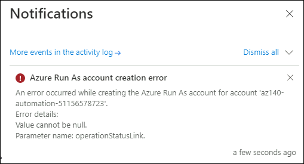

# Lab - Implement autoscaling in host pools (AD DS)
# Student lab manual

## Lab dependencies

- An Azure subscription you will be using in this lab.
- A Microsoft account or an Azure AD account with the Owner or Contributor role in the Azure subscription you will be using in this lab and with the Global Administrator role in the Azure AD tenant associated with that Azure subscription.
- The completed lab **Prepare for deployment of Azure Virtual Desktop (AD DS)**
- The completed lab **Deploy host pools and session hosts by using the Azure portal (AD DS)**

## Estimated Time

60 minutes

## Lab scenario

You need to configure autoscaling of Azure Virtual Desktop session hosts in an Active Directory Domain Services (AD DS) environment.

## Objectives
  
After completing this lab, you will be able to:

- Configure autoscaling of Azure Virtual Desktop session hosts
- Verify autoscaling of Azure Virtual Desktop session hosts

## Lab files

- None

## Instructions

### Exercise 0: Prerequisite - Setup Azure AD Connect
1. From your lab computer, start a web browser, navigate to the [Azure portal]( ), and sign in by providing credentials of a user account with the Owner role in the subscription you will be using in this lab.
2. In the Azure portal, search for and select **Virtual machines** and, from the **Virtual machines** blade, select **az140-dc-vm11**.
3. On the **az140-dc-vm11** blade, select **Connect**, in the drop-down menu, select **Bastion**, on the **Bastion** tab of the **az140-dc-vm11 \| Connect** blade, select **Use Bastion**.
4. When prompted, provide the following credentials and select **Connect**:

   |Setting|Value|
   |---|---|
   |User Name|**Student**|
   |Password|**Pa55w.rd1234**|

  > **Note**: On clicking **Connect**, if you encounter an error **A popup blocker is preventing new window from opening. Please allow popups and retry**, then select the popup blocker icon at the top, select **Always allow pop-ups and redirects from https://portal.azure.com** and click on **Done**, and try connecting to the VM again.
  
  > **Note**: If you are prompted **See text and images copied to the clipboard**, select **Allow**. 

5. Once logged in, a logon task will start executing. When prompted **Do you want PowerShell to install and import the Nuget provider now?** enter **Y** and hit enter.
   > **Note**: Wait for the logon task to complete and present you with **Microsoft Azure Active Directory Connect** wizard. This should take about 10 minutes. If the **Microsoft Azure Active Directory Connect** wizard is not presented to you after the logon task completes, then launch it manually by double clicking the **Azure AD Connect** icon on the desktop.


6. On the **Welcome to Azure AD Connect** page of the **Microsoft Azure Active Directory Connect** wizard, select the checkbox **I agree to the license terms and privacy notice** and select **Continue**.
7. On the **Express Settings** page of the **Microsoft Azure Active Directory Connect** wizard, select the **Customize** option.
8. On the **Install required components** page, leave all optional configuration options deselected and select **Install**.
9. On the **User sign-in** page, ensure that only the **Password Hash Synchronization** is enabled and select **Next**.
10. On the **Connect to Azure AD** page, authenticate by using the credentials of the **aadsyncuser** user account you created in the previous exercise and select **Next**. 

   > **Note**: Provide the userPrincipalName attribute of the **aadsyncuser** account available in the **LabValues** text file present on desktop and specify the password **Pa55w.rd1234**.

11. On the **Connect your directories** page, select the **Add Directory** button to the right of the **adatum.com** forest entry.
12. In the **AD forest account** window, ensure that the option to **Create new AD account** is selected, specify the following credentials, and select **OK**:

   |Setting|Value|
   |---|---|
   |User Name|**ADATUM\Student**|
   |Password|**Pa55w.rd1234**|

13. Back on the **Connect your directories** page, ensure that the **adatum.com** entry appears as a configured directory and select **Next**
14. On the **Azure AD sign-in configuration** page, note the warning stating **Users will not be able to sign-in to Azure AD with on-premises credentials if the UPN suffix does not match a verified domain name**, enable the checkbox **Continue without matching all UPN suffixes to verified domain**, and select **Next**.

   > **Note**: This is expected, since the Azure AD tenant does not have a verified custom DNS domain matching one of the UPN suffixes of the **adatum.com** AD DS.

15. On the **Domain and OU filtering** page, select the option **Sync selected domains and OUs**, expand the adatum.com node, clear all checkboxes, select only the checkbox next to the **ToSync** OU, and select **Next**.
16. On the **Uniquely identifying your users** page, accept the default settings, and select **Next**.
17. On the **Filter users and devices** page, accept the default settings, and select **Next**.
18. On the **Optional features** page, accept the default settings, and select **Next**.
19. On the **Ready to configure** page, ensure that the **Start the synchronization process when configuration completes** checkbox is selected and select **Install**.

   > **Note**: Installation should take about 2 minutes.

20. Review the information on the **Configuration complete** page and select **Exit** to close the **Microsoft Azure Active Directory Connect** window.

21. Within the Remote Desktop session to **az140-dc-vm11**, open Microsoft Edge browser shortcut for Azure or navigate to the [Azure portal](https://portal.azure.com). If prompted, sign in by using the Azure AD credentials of the user account with the Owner role in the subscription you are using in this lab.
22. In the Azure portal, use the **Search resources, services, and docs** text box at the top of the Azure portal page, search for and navigate to the **Azure Active Directory** blade and, on your Azure AD tenant blade, in the **Manage** section of the hub menu, select **Users**.
23. On the **All users (Preview)** blade, note that the list of user objects includes the listing of AD DS user accounts, with the **Yes** entry appearing in the **Directory synced** column.

   > **Note**: You might have to wait a few minutes and refresh the browser page for the AD DS user accounts to appear. Proceed to next step only if you are able to see the listing of AD DS user accounts you created. 

24. Now right click on the **Session-host** PowerShell file present on the desktop and select **Run with PowerShell** in the popup options. This will create the Session host.
    > **Note**: The script execution will take about 5 minutes. Once completed, the PowerShell window will display the text Session-host Task Completed Successfully` in green color and the Powershell window will automatically close after a few seconds.

25. From your lab computer, in the browser window displaying the Azure portal, search for and select Virtual machines and, on the Virtual machines blade, in the list of virtual machines, select az140-21-p1-0  under **operations** secction select **Run command** and  in the **Run Command Script** under **PowerShell Script** paste the content of p3script.ps1 available on desktop and click on **Run**. 

26. From your lab computer, in the browser window displaying the Azure portal, search for and select Virtual machines and, on the Virtual machines blade, in the list of virtual machines, select az140-21-p1-1  under **operations** secction select **Run command** and  in the **Run Command Script** under **PowerShell Script** paste the content of p3script.ps1 available on desktop and click on **Run**. 

27. From your lab computer, in the browser window displaying the Azure portal, search for and select Virtual machines and, on the Virtual machines blade, in the list of virtual machines, select az140-21-p1-2  under **operations** secction select **Run command** and  in the **Run Command Script** under **PowerShell Script** paste the content of p3script.ps1 available on desktop and click on **Run**. 


28. On the **az140-21-p1-0** blade, select **Connect**, in the drop-down menu, select **Bastion**, on the **Bastion** tab of the **az140-21-p1-0 \| Connect** blade, select **Use Bastion**.

    |Setting|Value|
    |---|---|
    |User Name|**Student**|
    |Password|**Pa55w.rd1234**|
   
29. Now right click on the **connect** PowerShell file present on the desktop and select **Run with PowerShell** in the popup options. This will join the Session host to host pool.
    > **Note**: If they ask for Execution policy change give **Y** and for Nuget provider is required to continue provide **y**.

30. When prompted, provide the credentials of the user account with the Owner role in the subscription you are using in this lab.

    > **Note**: Please follow previous 2 step(step 29 and 30) for virtual machine **az140-21-p1-1** and **az140-21-p1-2** .
 
31. In the Azure portal, search for Application group and select az140-24-hp3-DAG, then click on Assignments under Manage section.

32. Click on + Add and search for aduser1 and then click on Select.
33. Within the Remote Desktop session to az140-dc-vm11, in the web browser window displaying the Azure portal, search for and select Azure Virtual Desktop and, on the Azure Virtual Desktop blade, select Application groups.
34. On the application groups blade, select + Create.
35. On the Basics tab of the Create an application group blade, specify the following settings and select Next: Applications >:

    |Setting|Value|
     |---|---|
     |Subscription|the name of the Azure subscription you are using in this lab|
     |Resource group|**az140-11-RG**|
     |Host pool|**az140-21-hp1**|
     |Application group type|**RemoteApp**|
     |Application group name|**az140-21-hp1-Utilities-RAG**|
     
36. On the **Applications** tab of the **Create an application group** blade, select **+ Add applications**.
37. On the **Add application** blade, specify the following settings and select **Save**:

    |Setting|Value|
     |---|---|
     |Application source|**File path**|
     |Application path|**C:\Windows\system32\cmd.exe**|
     |Application name|**Command Prompt**|
     |Display name|**Command Prompt**|
     |Icon path|**C:\Windows\system32\cmd.exe**|
     |Icon index|**0**|
     |Description|**Windows Command Prompt**|
     |Require command line|**No**|

38. Back on the **Applications** tab of the **Create an application group** blade, select **Next: Assignments >**.
39. On the **Assignments** tab of the **Create an application group** blade, select **+ Add Azure AD users or user groups**.
40. On the **Select Azure AD users or user groups** blade, select **aduser1** and click on **Select**.
41. Back on the **Assignments** tab of the **Create an application group** blade, select **Next: Workspace >**.
42. On the **Workspace** tab of the **Create a workspace** blade, specify the following setting and select **Review + create**:

    |Setting|Value|
     |---|---|
     |Register application group|**yes**|

43. On the **Review + create** tab of the **Create an application group** blade, select **Create**.


### Exercise 1: Configure autoscaling of Azure Virtual Desktop session hosts

The main tasks for this exercise are as follows:

1. Prepare for autoscaling of Azure Virtual Desktop session hosts
1. Create and configure an Azure Automation account
1. Create an Azure Logic app


#### Task 1: Create and configure an Azure Automation account

1. From your lab computer, start a web browser, navigate to the [Azure portal](https://portal.azure.com), and sign in by providing credentials of a user account with the Owner role in the subscription you will be using in this lab.
1. In the Azure portal, search for and select **Virtual machines** and, from the **Virtual machines** blade, select **az140-dc-vm11**.
1. On the **az140-dc-vm11** blade, select **Connect**, in the drop-down menu, select **Bastion**, on the **Bastion** tab of the **az140-dc-vm11 \| Connect** blade, select **Use Bastion**.
1. When prompted, provide the following credentials and select **Connect**:

   |Setting|Value|
   |---|---|
   |User Name|**Student**|
   |Password|**Pa55w.rd1234**|

1. Within the Remote Desktop session to **az140-dc-vm11**, start **Windows PowerShell ISE** as administrator.

1. Run the following to download the PowerShell script you will use to create the Azure Automation account that is part of the autoscaling solution:

   ```powershell
   [Net.ServicePointManager]::SecurityProtocol = [Net.SecurityProtocolType]::Tls12
   $labFilesfolder = 'C:\Allfiles\Labs\05'
   New-Item -ItemType Directory -Path $labFilesfolder -Force
   Set-Location -Path $labFilesfolder
   $uri = 'https://raw.githubusercontent.com/CloudLabs-MOC/AZ-140-Configuring-and-Operating-Microsoft-Azure-Virtual-Desktop/stage/Instructions/Labs/CreateOrUpdateAzAutoAccount.ps1'
   Invoke-WebRequest -Uri $Uri -OutFile '.\CreateOrUpdateAzAutoAccount.ps1'
   ```

1. Within the Remote Desktop session to **az140-dc-vm11**, on the **Administrator: Windows PowerShell ISE** script pane, paste the following script, and run it to create the Azure Automation account that is part of the autoscaling solution:

   ```powershell
   [Net.ServicePointManager]::SecurityProtocol = [Net.SecurityProtocolType]::Tls12
   .\CreateOrUpdateAzAutoAccount.ps1 
   ```

   >**Note**: Wait for the script to complete. This might take about 10 minutes.

1. Within the Remote Desktop session to **az140-dc-vm11**, in the **Administrator: Windows PowerShell ISE** script pane, review the output of the script. 

   >**Note**: The output includes a webhook URI, the Log Analytics Workspace ID and the corresponding primary key values that you need to provide when provisioning the Azure Logic App that is part of the autoscaling solution. 
   
   >**Note**: Record the value of the webhook URI. You will need it later in this lab.

1. To verify the configuration of the Azure Automation account, within the Remote Desktop session to **az140-dc-vm11**, start Microsoft Edge and navigate to the [Azure portal](https://portal.azure.com). If prompted, sign in by using the Azure AD credentials of the user account with the Owner role in the subscription you are using in this lab.
1. Within the Remote Desktop session to **az140-dc-vm11**, in the Microsoft Edge window displaying the Azure portal, search for and select **Automation accounts** and, on the **Automation accounts** blade, select the entry representing the newly provisioned Azure Automation account (with the name starting with the **az140-automation-51** prefix).
1. On the Automation Account blade, in the vertical menu on the left side, in the **Process Automation** section, select **Runbooks** and, in the list of runbooks, verify the presence of the **WVDAutoScaleRunbookARMBased** runbook.
1. On the Automation Account blade, in the vertical menu on the left side, in the **Account Settings** section, select **Run as accounts** and, in the list of accounts on the right side, next to the **+ Azure Run As Account**, click **Create**.
1. On the **Add Azure Run As Account** blade, click **Create** and verify that the new account was successfully created.

   > **Note**: You can ignore the **Azure Run As account creation error**, the account will be created regardless of the error.

   

#### Task 2: Create an Azure Logic app

1. Within the Remote Desktop session to **az140-dc-vm11**, switch to the **Administrator: Windows PowerShell ISE** window and, from the **Administrator: Windows PowerShell ISE** script pane, run the following to run the following to download the PowerShell script you will use to create the Azure Logic app that is part of the autoscaling solution:

   ```powershell
   $labFilesfolder = 'C:\Allfiles\Labs\05'
   Set-Location -Path $labFilesfolder
   $uri = "https://raw.githubusercontent.com/Azure/RDS-Templates/master/wvd-templates/wvd-scaling-script/CreateOrUpdateAzLogicApp.ps1"
   Invoke-WebRequest -Uri $uri -OutFile ".\CreateOrUpdateAzLogicApp.ps1"
   ```

1. Within the Remote Desktop session to **az140-dc-vm11**, from the **Administrator: Windows PowerShell ISE**, Select the **File** from the top menu and open the **C:\\Allfiles\\Labs\\05\\CreateOrUpdateAzLogicApp.ps1** script, enclose the code between lines **134** an **138** into the multiline comment and save, such that they look as follows:

   ```powershell
   <#
   # Get the Role Assignment of the authenticated user
   $RoleAssignments = Get-AzRoleAssignment -SignInName $AzContext.Account -ExpandPrincipalGroups
   if (!($RoleAssignments | Where-Object { $_.RoleDefinitionName -in @('Owner', 'Contributor') })) {
	throw 'Authenticated user should have the Owner/Contributor permissions to the subscription'
   }
   #>
   ```

1. Within the Remote Desktop session to **az140-dc-vm11**, from the **Administrator: Windows PowerShell ISE** script pane, run the following to set the values of variables that you will assign to script parameters (replace the `<webhook_URI>` placeholder with the value of the webhook URI you recorded earlier in this lab):

   ```powershell
   $AADTenantId = (Get-AzContext).Tenant.Id
   $AzSubscription = (Get-AzContext).Subscription.Id
   $ResourceGroup = Get-AzResourceGroup -Name 'az140-51-RG'
   $WVDHostPool = Get-AzResource -ResourceType "Microsoft.DesktopVirtualization/hostpools" -Name 'az140-21-hp1'
   $LogAnalyticsWorkspace = (Get-AzOperationalInsightsWorkspace -ResourceGroupName $ResourceGroup.ResourceGroupName)[0]
   $LogAnalyticsWorkspaceId = $LogAnalyticsWorkspace.CustomerId
   $LogAnalyticsWorkspaceKeys = (Get-AzOperationalInsightsWorkspaceSharedKey -ResourceGroupName $ResourceGroup.ResourceGroupName -Name $LogAnalyticsWorkspace.Name)
   $LogAnalyticsPrimaryKey = $LogAnalyticsWorkspaceKeys.PrimarySharedKey
   $RecurrenceInterval = 2
   $BeginPeakTime = '1:00'
   $EndPeakTime = '1:01'
   $TimeDifference = '0:00'
   $SessionThresholdPerCPU = 1
   $MinimumNumberOfRDSH = 1
   $MaintenanceTagName = 'CustomMaintenance'
   $LimitSecondsToForceLogOffUser = 5
   $LogOffMessageTitle = 'Autoscaling'
   $LogOffMessageBody = 'Forcing logoff due to autoscaling'

   $AutoAccount = (Get-AzAutomationAccount -ResourceGroupName $ResourceGroup.ResourceGroupName)[0]
   $AutoAccountConnection = Get-AzAutomationConnection -ResourceGroupName $AutoAccount.ResourceGroupName -AutomationAccountName $AutoAccount.AutomationAccountName

   $WebhookURIAutoVar = '<webhook_URI>'
   ```

   >**Note**: The values of parameters are geared towards accelerating the autoscaling behavior. In your production environment, you should adjust them to match your own specific requirements.

1. Within the Remote Desktop session to **az140-dc-vm11**, from the **Administrator: Windows PowerShell ISE** script pane, run the following to create the Azure Logic app that is part of the autoscaling solution:

   ```powershell
   $Params = @{
     "AADTenantId"                   = $AADTenantId                             # Optional. If not specified, it will use the current Azure context
     "SubscriptionID"                = $AzSubscription.Id                       # Optional. If not specified, it will use the current Azure context
     "ResourceGroupName"             = $ResourceGroup.ResourceGroupName         # Optional. Default: "WVDAutoScaleResourceGroup"
     "Location"                      = $ResourceGroup.Location                  # Optional. Default: "West US2"
     "UseARMAPI"                     = $true
     "HostPoolName"                  = $WVDHostPool.Name
     "HostPoolResourceGroupName"     = $WVDHostPool.ResourceGroupName           # Optional. Default: same as ResourceGroupName param value
     "LogAnalyticsWorkspaceId"       = $LogAnalyticsWorkspaceId                 # Optional. If not specified, script will not log to the Log Analytics
     "LogAnalyticsPrimaryKey"        = $LogAnalyticsPrimaryKey                  # Optional. If not specified, script will not log to the Log Analytics
     "ConnectionAssetName"           = $AutoAccountConnection.Name              # Optional. Default: "AzureRunAsConnection"
     "RecurrenceInterval"            = $RecurrenceInterval                      # Optional. Default: 15
     "BeginPeakTime"                 = $BeginPeakTime                           # Optional. Default: "09:00"
     "EndPeakTime"                   = $EndPeakTime                             # Optional. Default: "17:00"
     "TimeDifference"                = $TimeDifference                          # Optional. Default: "-7:00"
     "SessionThresholdPerCPU"        = $SessionThresholdPerCPU                  # Optional. Default: 1
     "MinimumNumberOfRDSH"           = $MinimumNumberOfRDSH                     # Optional. Default: 1
     "MaintenanceTagName"            = $MaintenanceTagName                      # Optional.
     "LimitSecondsToForceLogOffUser" = $LimitSecondsToForceLogOffUser           # Optional. Default: 1
     "LogOffMessageTitle"            = $LogOffMessageTitle                      # Optional. Default: "Machine is about to shut down."
     "LogOffMessageBody"             = $LogOffMessageBody                       # Optional. Default: "Your session will be logged off. Please save and close everything."
     "WebhookURI"                    = $WebhookURIAutoVar
   }

   .\CreateOrUpdateAzLogicApp.ps1 @Params
   ```

   >**Note**: Wait for the script to complete. This might take about 2 minutes.

1. To verify the configuration of the Azure Logic app, within the Remote Desktop session to **az140-dc-vm11**, switch to the Microsoft Edge window displaying the Azure portal, search for and select **Logic Apps** and, on the **Logic apps** blade, select the entry representing the newly provisioned Azure Logic app named **az140-21-hp1_Autoscale_Scheduler**.
1. On the **az140-21-hp1_Autoscale_Scheduler** blade, in the vertical menu on the left side, in the **Development Tools** section, select **Logic app designer**. 
1. On the designer pane, click the rectangle labeled **Recurrence** and note that you can use it to control frequency in which the need for autoscaling is evaluated. 

### Exercise 2: Verify and review autoscaling of Azure Virtual Desktop session hosts

The main tasks for this exercise are as follows:

1. Verify autoscaling of Azure Virtual Desktop session hosts
1. Use Azure Log Analytics to track Azure Virtual Desktop events

#### Task 1: Verify autoscaling of Azure Virtual Desktop session hosts 

1. To verify the autoscaling of the Azure Virtual Desktop session hosts, within the Remote Desktop session to **az140-dc-vm11**, in the Microsoft Edge window displaying the Azure portal, search for and select **Virtual machines** and, on the **Virtual machines** blade, review the status of the three Azure VMs in the **az140-21-RG** resource group.

   >**Note**: As soon as you verify that autoscaling is working, you should disable the Azure Logic app to minimize the corresponding charges.

1. To disable the Azure Logic app, within the Remote Desktop session to **az140-dc-vm11**, in the Microsoft Edge window displaying the Azure portal, search for and select **Logic Apps** and, on the **Logic apps** blade, select the entry representing the newly provisioned Azure Logic app named **az140-21-hp1_Autoscale_Scheduler**.
1. On the **az140-21-hp1_Autoscale_Scheduler** blade, in the toolbar, click **Disable**. 
1. On the **az140-21-hp1_Autoscale_Scheduler** blade, in the **Essentials** section, review the information including the number of successful runs in the last 24 hours and the **Summary** section providing the frequency of recurrence. 
1. Within the Remote Desktop session to **az140-dc-vm11**, in the Microsoft Edge window displaying the Azure portal, search for and select **Automation accounts** and, on the **Automation accounts** blade, select the entry representing the newly provisioned Azure Automation account (with the name starting with the **az140-automation-51** prefix).
1. On the **Automation Account** blade, in the vertical menu on the left side, in the **Process Automation** section, select **Jobs** and review the list of jobs corresponding to individual invocations of the **WVDAutoScaleRunbookARMBased** runbook.
1. Select the most recent job and, on its blade, click **All Logs** tab header. This will display detailed listing of job execution steps.

#### Task 2: Use Azure Log Analytics to track Azure Virtual Desktop events (Read-Only)

>**Note**: To analyze autoscaling and any other Azure Virtual Desktop events, you can use Log Analytics.

1. Within the Remote Desktop session to **az140-dc-vm11**, in the Microsoft Edge window displaying the Azure portal, search for and select **Log Analytics workspaces** and, on the **Log Analytics workspaces** blade, select the entry representing the Azure Log Analytics workspace used in this lab (which name starts with the **az140-workspace-51** prefix.
1. On the Log Analytics workspace blade, in the vertical menu on the left side, in the **General** section, click **Logs**, if needed, close the **Welcome to Log Analytics** window, and proceed to the **Query** pane.
1. On the **Queries** pane, in the **All Queries** vertical menu on the left side, select **Azure Virtual Desktop** and review the predefined queries.
1. Close the **Queries** pane. This will automatically display the **New Query 1** tab.
1. In the query window, paste the following query, click **Run** to display all events for the host pool used in this lab:

   ```kql
   WVDTenantScale_CL
   | where hostpoolName_s == "az140-21-hp1"
   | project TimeStampUTC = TimeGenerated, TimeStampLocal = TimeStamp_s, HostPool = hostpoolName_s, LineNumAndMessage = logmessage_s, AADTenantId = TenantId
   ```

   >**Note**: If there was an extra pipe character (|) in second line when using the cut an paste contrsuct, remove it to avoid a failure. This could apply to each query.
   >**Note**: If you don't see any results, wait a few minutes and try again.

1. In the query window, paste the following query, click **Run** to display the total number of currently running session hosts and active user sessions in the target host pool:

   ```kql
   WVDTenantScale_CL
   | where logmessage_s contains "Number of running session hosts:"
     or logmessage_s contains "Number of user sessions:"
     or logmessage_s contains "Number of user sessions per Core:"
   | where hostpoolName_s == "az140-21-hp1"
   | project TimeStampUTC = TimeGenerated, TimeStampLocal = TimeStamp_s, HostPool = hostpoolName_s, LineNumAndMessage = logmessage_s, AADTenantId = TenantId
   ```

1. In the query window, paste the following query, click **Run** to display the status of all session host VMs in a host pool:

   ```kql
   WVDTenantScale_CL
   | where logmessage_s contains "Session host:"
   | where hostpoolName_s == "az140-21-hp1"
   | project TimeStampUTC = TimeGenerated, TimeStampLocal = TimeStamp_s, HostPool = hostpoolName_s, LineNumAndMessage = logmessage_s, AADTenantId = TenantId
   ```

1. In the query window, paste the following query, click **Run** to display any scaling related errors and warnings:

   ```kql
   WVDTenantScale_CL
   | where logmessage_s contains "ERROR:" or logmessage_s contains "WARN:"
   | project TimeStampUTC = TimeGenerated, TimeStampLocal = TimeStamp_s, HostPool = hostpoolName_s, LineNumAndMessage = logmessage_s, AADTenantId = TenantId
   ```

>**Note**: Ignore the error message regarding `TenantId`
