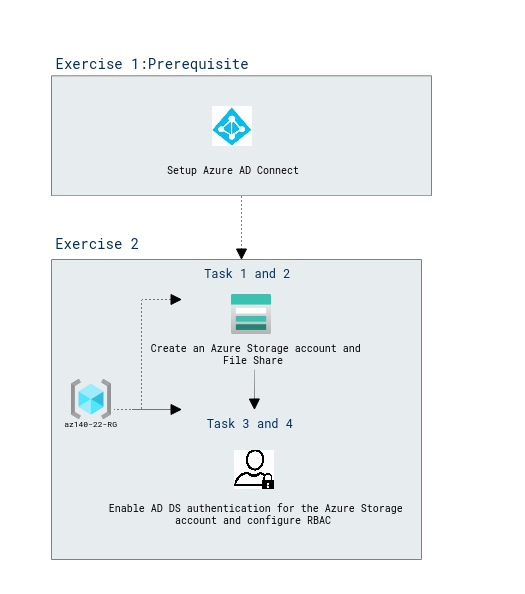

# Lab Scenario Preview: AZ-140: Implement an Azure Virtual Desktop infrastructure

## Lab 03: Implement and manage storage for AVD (AD DS)

### Lab overview

In this lab, you will learn how to choose and configure appropriate storage for FSLogix components and Azure Files.

### Objectives
  
After completing this lab, you will be able to:

- Create an Azure Storage account
- Create an Azure Files share
- Enable AD DS authentication for the Azure Storage account
- Configure the Azure Files RBAC-based permissions
- Configure the Azure Files file system permissions

### Architecture Diagram

   

Once you understand the lab's content, you can start the Hands-on Lab by clicking the **Launch** button located in the top right corner. This will lead you to the lab environment and guide. You can also preview the full lab guide [here](https://experience.cloudlabs.ai/#/labguidepreview/f49fb2ca-a4e8-458b-add5-160c69fb41fc) if you want to go through detailed guide prior to launching lab environment.  