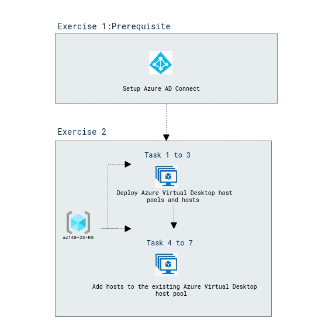

# Lab Scenario Preview: AZ-140: Implement an Azure Virtual Desktop infrastructure

## Lab 04: Deploy host pools and hosts by using Azure Resource Manager templates

### Lab overview

In this lab, you will learn how to automate the deployment of Azure Virtual Desktop host pools and hosts by using Azure Resource Manager templates.

### Objectives
  
After completing this lab, you will be able to:

- Deploy Azure Virtual Desktop host pools and hosts by using Azure Resource Manager templates

### Architecture Diagram

   

Once you understand the lab's content, you can start the Hands-on Lab by clicking the **Launch** button located in the top right corner. This will lead you to the lab environment and guide. You can also preview the full lab guide [here](https://experience.cloudlabs.ai/#/labguidepreview/90416d31-1b00-4b35-bc1a-db88ed896406) if you want to go through detailed guide prior to launching lab environment.  