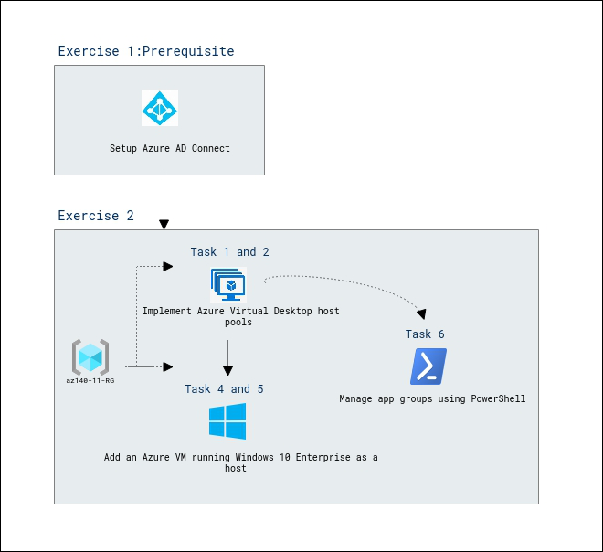

# Lab Scenario Preview: AZ-140: Implement an Azure Virtual Desktop infrastructure

## Lab 05: Deploy and manage host pools and hosts by using PowerShell

### Lab overview

In this lab, you will learn how to automate the deployment of Azure Virtual Desktop host pools and hosts by using PowerShell in an Active Directory Domain Services (AD DS) environment.

## Objectives
  
After completing this lab, you will be able to:

- Deploy Azure Virtual Desktop host pools and hosts by using PowerShell
- Add hosts to the Azure Virtual Desktop host pool by using PowerShell

## Architecture Diagram

   
