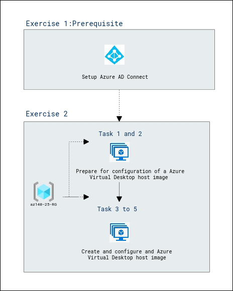

# Lab Scenario Preview: AZ-140: Implement an Azure Virtual Desktop infrastructure

## Lab 06: Create and manage session host images (AD DS)

### Lab overview

In this lab, you will learn how a Shared Image Gallery simplifies custom image sharing across your organization.

### Objectives
  
After completing this lab, you will be able to:

- Prepare for configuration of a Azure Virtual Desktop host image
- Deploy Azure Bastion
- Configure a Azure Virtual Desktop host image
- Create a Azure Virtual Desktop host image
- Provision a Azure Virtual Desktop host pool by using the custom image
  
### Architecture Diagram

   

Now that you know what the lab is going to be all about, you can launch next item **Hands-on Lab** which includes lab environment and lab guide. You can also preview the full lab guide [here](https://experience.cloudlabs.ai/#/labguidepreview/82428b09-24a7-424e-8069-6049ecb6b4b5) if you want to go through detailed guide prior to launching lab environment.  