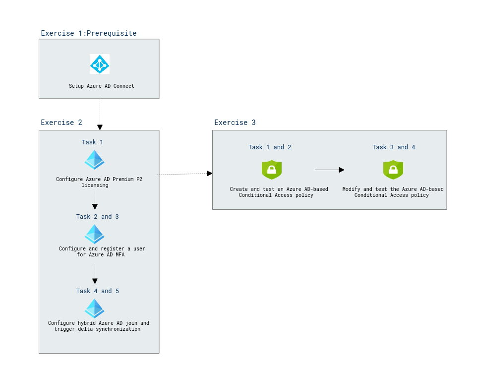

# Lab Scenario Preview: AZ-140: Manage access and security for Azure Virtual Desktop

## Lab 07: Configure Conditional Access policies for WVD (AD DS)

### Lab overview

In this lab, you will learn about need to controling the access to a deployment of Azure Virtual Desktop in an Active Directory Domain Services (AD DS) environment by using Azure Active Directory (Azure AD) conditional access.

### Objectives
  
After completing this lab, you will be able to:

- Prepare for Azure Active Directory (Azure AD)-based Conditional Access for Azure Virtual Desktop
- Implement Azure AD-based Conditional Access for Azure Virtual Desktop

### Architecture Diagram

   

Once you understand the lab's content, you can start the Hands-on Lab by clicking the **Launch** button located in the top right corner. This will lead you to the lab environment and guide. You can also preview the full lab guide [here](https://experience.cloudlabs.ai/#/labguidepreview/878d3128-d776-43c6-bd17-4495af37e7ef) if you want to go through detailed guide prior to launching lab environment.  