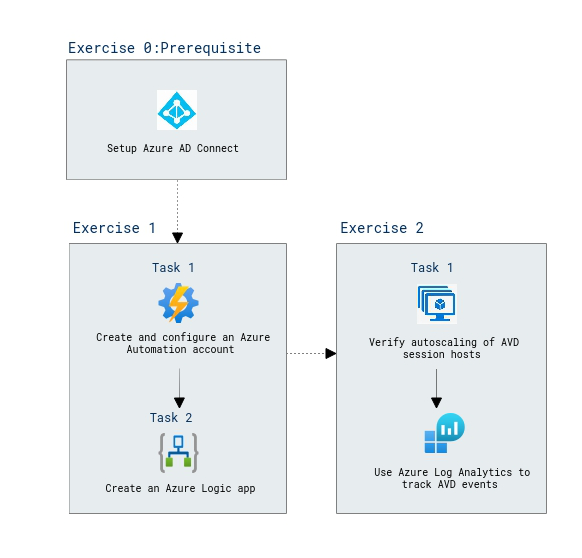

# Lab Scenario Preview: AZ-140: Monitor and maintain an Azure Virtual Desktop infrastructure

## Lab 09: Implement autoscaling in host pools (AD DS)

### Lab overview

In this lab, you will learn about configure autoscaling of Azure Virtual Desktop session hosts in an Active Directory Domain Services (AD DS) environment.

### Objectives
  
After completing this lab, you will be able to:

- Configure autoscaling of Azure Virtual Desktop session hosts
- Verify autoscaling of Azure Virtual Desktop session hosts

### Architecture Diagram

   

Once you understand the lab's content, you can start the Hands-on Lab by clicking the **Launch** button located in the top right corner. This will lead you to the lab environment and guide. You can also preview the full lab guide [here](https://experience.cloudlabs.ai/#/labguidepreview/866d1b89-951e-402e-a207-a8be0156c784) if you want to go through detailed guide prior to launching lab environment.  